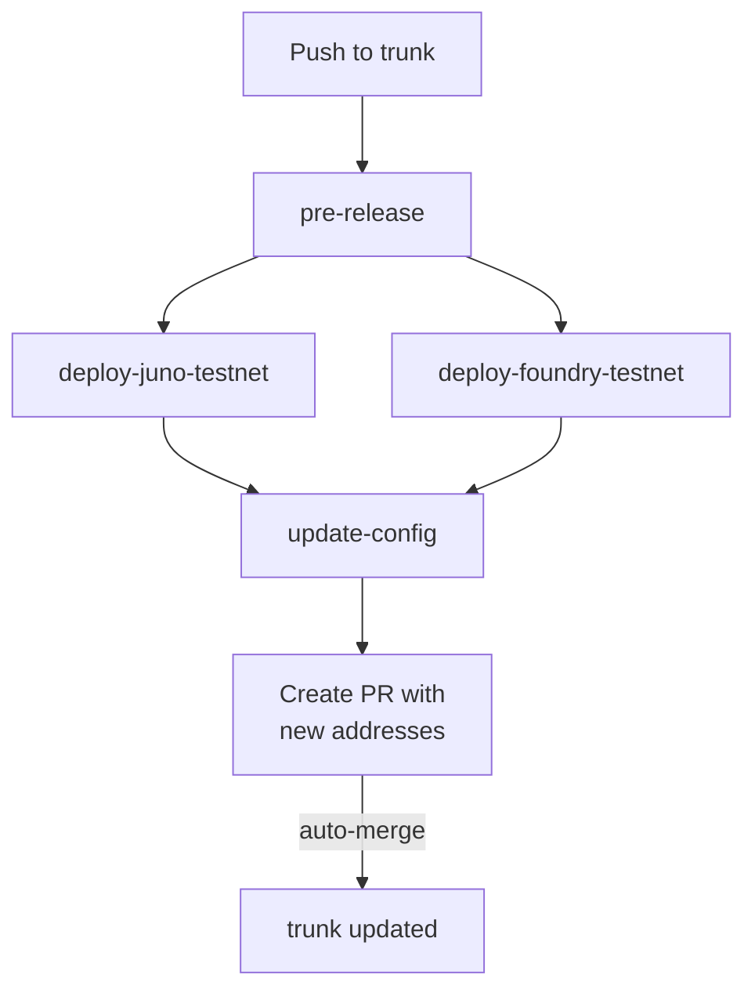
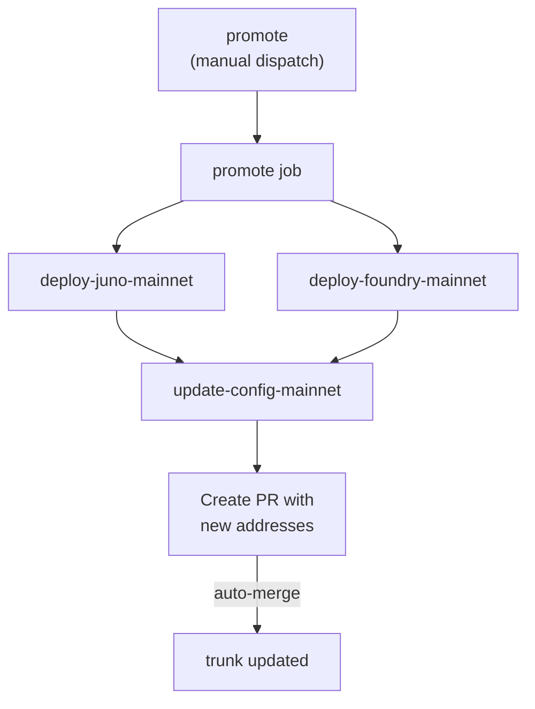
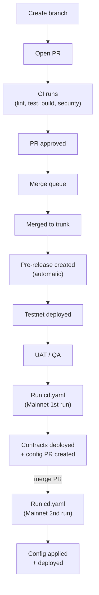

# CI/CD Architecture

## Overview

Mixing blockchains comes with _unique challenges_;

- The ICP Oracle address is stable only after the initial bootstrap — it's stored in `config/tresr.yaml`.
- Juno and Foundry deploys run **in parallel** — neither waits for the other.
- Contract addresses are written back to `config/tresr.yaml` when changed via an auto-merged PR.

## Environments

There are 3 environments, but only 2 are managed with CI/CD.

- Local
- Testnet
- Mainnet

### Testnet

Testnet deployments happen automatically on any merge into the _trunk_ branch.

### Mainnet

Mainnet deployments only occur after a _manual promotion_ process with gated approvals.

## Developer Workflow

## The "Gatekeeper" Strategy

The CI design uses a strictly-parallel orchestration pipeline pattern. This allows us to _warm_ the cache first, speeding up any subsequent parallel jobs.

1. `ci.yaml` and `cd.yaml` act as absolute entry points (Gatekeepers).
2. The gatekeeper triggers `setup-devenv` synchronously, populating the GitHub L2 cache.
3. Once populated, the Gatekeeper fires off all subsequent workflows.

## Foundry Deploy

Foundry deploys are split into two `workflow_call`-only workflows called by the unified `cd.yaml`:

| Workflow                  | Environment | Contracts deployed            |
| ------------------------- | ----------- | ----------------------------- |
| `cd-foundry-testnet.yaml` | Testnet     | Test Token, Faucet, Vault     |
| `cd-foundry-mainnet.yaml` | Mainnet     | Vault only (real TRESR token) |

Both are `workflow_call` only — they read `oracle_address` from `config/tresr.yaml` via `foundry-deploy-setup`, and run in parallel with their corresponding Juno deploy job.

> [!NOTE]
> On first bootstrap, the oracle address must be in `config/tresr.yaml` **before** the Foundry
> deploy runs. Populate it by running a Juno-only deploy first via `bootstrap` dispatch, or by
> manually updating `config/tresr.yaml` after the initial Juno deploy and merging the PR.

Shared logic is extracted into four composite actions under
`.github/actions/`:

| Action                   | Purpose                                          |
| ------------------------ | ------------------------------------------------ |
| `detect-foundry-changes` | Check contract source changes since last git tag |
| `foundry-deploy-setup`   | Secret checks, caching, config, balance, build   |
| `foundry-resolve-vault`  | Detect deploy/upgrade mode, run Forge scripts    |
| `foundry-deploy-summary` | Generate GitHub Actions job summary              |

### Change Detection

A `detect-changes` job gates the deploy:

| Trigger         | Behaviour                                              |
| --------------- | ------------------------------------------------------ |
| `workflow_call` | Compares `contracts/**` changes since previous git tag |

> [!NOTE]
> Config-only changes (e.g. `config/tresr.yaml`) do **not** trigger
> a contract redeployment. The `detect-changes` job skips the deploy.

### Wallet Balance Check

Before any deployment, the pipeline checks the deployer wallet has at
least **0.1 AVAX** (`MIN_DEPLOYER_BALANCE` env var, set in wei).
If the balance is too low, the workflow fails early with a clear error.

### Token + Faucet (Testnet Only)

The `DeployToken.s.sol` script deploys `RonToken` (test ERC-20)
and `TresrFaucet`. This exists only in `cd-foundry-testnet.yaml` —
the mainnet workflow deploys the Vault only (using the real TRESR token).

### Vault (Deploy vs Upgrade)

The pipeline auto-detects whether to do a **fresh deploy** or an
**upgrade** based on the `vault_contract` address in
`config/tresr.yaml`:

| `vault_contract` value     | Pipeline action                                  |
| -------------------------- | ------------------------------------------------ |
| Zero address (`0x0000...`) | Fresh deploy via `Vault.s.sol` (impl + proxy)    |
| Non-zero address           | Upgrade via `UpgradeVault.s.sol` (new impl only) |

#### Fresh Deploy (first time)

1. `Vault.s.sol` deploys the `TresrVault` implementation and
   an `ERC1967Proxy`
2. The proxy address appears in the GitHub Actions job summary
3. **You must update `vault_contract` in `config/tresr.yaml`
   with the proxy address**
4. Push the config change (this does NOT re-trigger contract deployment)

#### Upgrade (subsequent changes)

1. `UpgradeVault.s.sol` deploys a new implementation contract
2. The GitHub Actions job summary shows a **Safe Transaction** section
   with the proxy address, new implementation address, and the
   `upgradeToAndCall` calldata
3. A Safe signer pastes the calldata into the Gnosis Safe
   Transaction Builder

> [!IMPORTANT]
> The CI deployer EOA **cannot** execute the upgrade.
> The `_authorizeUpgrade` function on `TresrVault` requires
> `DEFAULT_ADMIN_ROLE`, which belongs to the Gnosis Safe multisig.
> The pipeline only deploys the new code -- a multisig signer must
> approve the actual upgrade.

### Multisig Upgrade Steps

1. Open the GitHub Actions run for the CD workflow
2. Scroll to the **job summary** -- the Safe transaction details
   are displayed there
3. In the Gnosis Safe UI -- **Transaction Builder** -- **Custom data**:
   - **To**: the proxy address (shown in summary)
   - **Value**: `0`
   - **Data**: paste the calldata from the summary
4. Submit and collect required signatures
5. Once executed, the proxy points to the new implementation

> [!TIP]
> After a successful deploy, the `update-config` job in the release workflow
> automatically creates a PR to update `config/tresr.yaml` with the new
> contract addresses. Review and merge that PR to complete the cycle.
