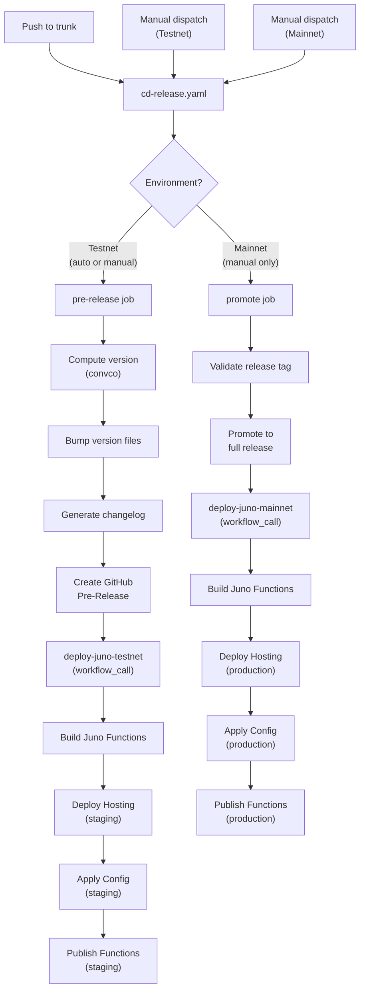
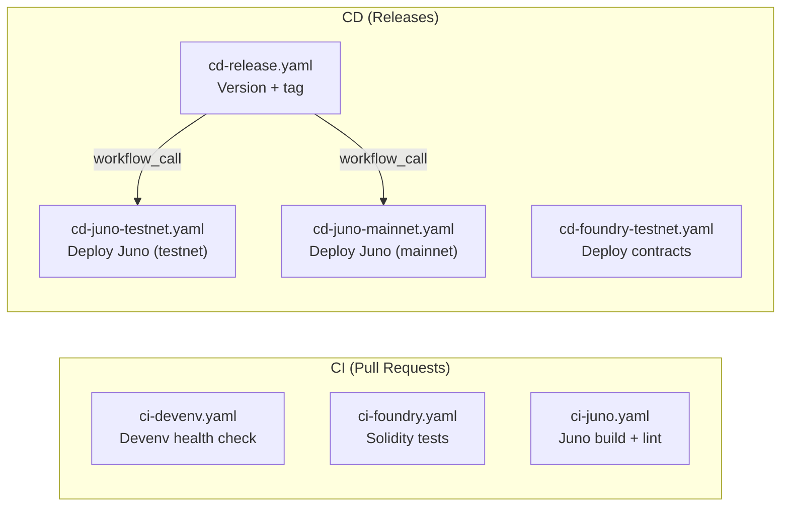

# CI/CD Pipeline

## Overview

The tresr-game project uses GitHub Actions for CI/CD with a release-driven deployment model.
Workflows are chained using `workflow_call` for reliable, explicit orchestration.

## Release Flow

## CI Pipelines

## Workflows

| Workflow                  | Trigger                      | Description                                |
| ------------------------- | ---------------------------- | ------------------------------------------ |
| `ci-devenv.yaml`          | PR, push                     | Validates devenv builds correctly          |
| `ci-foundry.yaml`         | PR, push                     | Runs Solidity tests via Foundry            |
| `ci-juno.yaml`            | PR, push                     | Builds Juno satellite + functions          |
| `cd-release.yaml`         | Push to trunk, manual        | Creates pre-release or promotes to release |
| `cd-foundry-testnet.yaml` | Push to trunk (contracts/)   | Deploys Solidity contracts to Fuji         |
| `cd-juno-testnet.yaml`    | Called by cd-release, manual | Deploys Juno to testnet                    |
| `cd-juno-mainnet.yaml`    | Called by cd-release, manual | Deploys Juno to mainnet                    |

## Environments

| Environment | Purpose                                    | Secrets                                                   |
| ----------- | ------------------------------------------ | --------------------------------------------------------- |
| **Testnet** | Staging deployments                        | `JUNO_TOKEN`, `DEPLOYER_PRIVATE_KEY`, `SNOWTRACE_API_KEY` |
| **Mainnet** | Production deployments (requires approval) | `JUNO_TOKEN`, `DEPLOYER_PRIVATE_KEY`, `SNOWTRACE_API_KEY` |

## Design Decisions

### workflow_call over event chaining

Deploy workflows are called directly via `workflow_call` rather than triggered by `release` events
(`prereleased`/`released`). This avoids [GitHub's `GITHUB_TOKEN` limitation](https://docs.github.com/en/actions/writing-workflows/choosing-when-your-workflow-runs/triggering-a-workflow#triggering-a-workflow-from-a-workflow)
where events created by `GITHUB_TOKEN` do not trigger other workflows.

Deploy workflows also support `workflow_dispatch` for manual re-runs independent of the release flow.
