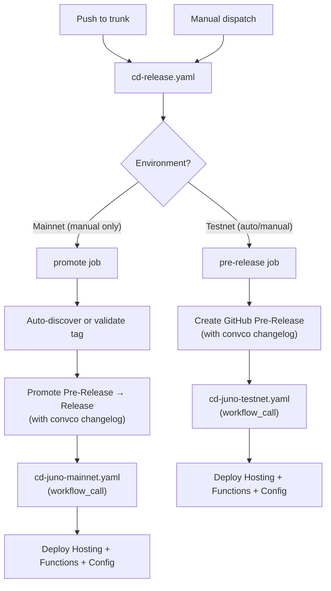
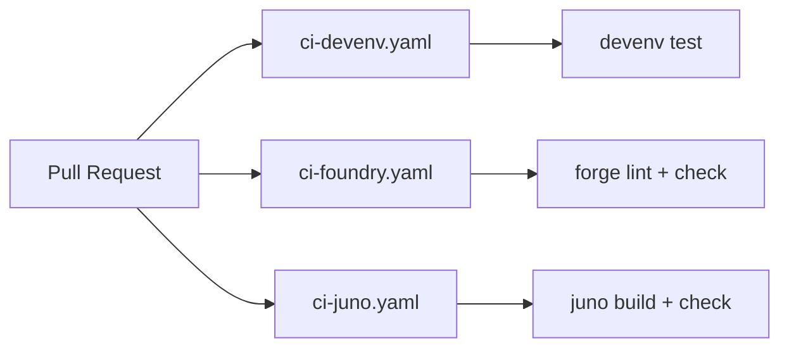

# CI/CD Architecture

## Release Flow

## Developer Workflow

```mermaid
graph LR
    A["Create branch"] --> B["Open PR"]
    B --> C["CI runs<br/>(lint, test, build, security)"]
    C --> D["PR approved"]
    D --> E["Merge queue"]
    E --> F["Merged to trunk"]
    F --> G["Pre-release created<br/>(automatic)"]
    G --> H["Testnet deployed"]
    H --> I["UAT / QA"]
    I --> J["Run cd-release<br/>(Mainnet)"]
    J --> K["Promoted + deployed"]
```

## Manually Runnable Workflows

Only these workflows can be triggered manually via `workflow_dispatch`:

| Workflow                   | Purpose                                           |
| -------------------------- | ------------------------------------------------- |
| `cd-release.yaml`          | Create pre-release (Testnet) or promote (Mainnet) |
| `cd-foundry.yaml`          | Deploy Solidity contracts to Testnet or Mainnet   |
| `chore-devenv-update.yaml` | Update devenv.lock, create PR                     |

All other workflows are triggered automatically by events (PR, push, merge_group, schedule, workflow_call).

## Mainnet Promotion

When running `cd-release.yaml` with `Environment: Mainnet`:

- **With `release_tag`**: Promotes that specific pre-release
- **Without `release_tag`**: Auto-discovers the latest pre-release and promotes it
- **If latest release is already promoted**: Errors with a helpful message

The GitHub `Mainnet` environment requires manual approval before the promote job runs.

## Foundry Deploy

`cd-foundry.yaml` is a single parameterized workflow that handles both testnet and mainnet:

- **Push to trunk** (contracts/ changes) → always deploys to Testnet
- **Manual dispatch** → choose Testnet or Mainnet

Config values (RPC URL, addresses) are read dynamically from `config/tresr.yaml` based on the resolved network.

## CI Pipeline

## Workflow Inventory

| Workflow                   | Prefix | Trigger                         | Purpose                                  |
| -------------------------- | ------ | ------------------------------- | ---------------------------------------- |
| `cd-release.yaml`          | cd     | push to trunk, dispatch         | Create pre-release or promote to release |
| `cd-juno-testnet.yaml`     | cd     | workflow_call only              | Deploy Juno to Testnet                   |
| `cd-juno-mainnet.yaml`     | cd     | workflow_call only              | Deploy Juno to Mainnet                   |
| `cd-foundry.yaml`          | cd     | push (contracts/), dispatch     | Deploy Solidity contracts                |
| `ci-devenv.yaml`           | ci     | pull_request, merge_group       | Test devenv shell                        |
| `ci-foundry.yaml`          | ci     | pull_request, merge_group       | Lint and check Solidity                  |
| `ci-juno.yaml`             | ci     | pull_request, merge_group       | Build and check Juno                     |
| `chore-devenv-update.yaml` | chore  | schedule (weekly), dispatch     | Update devenv.lock, create PR            |
| `chore-pr-title.yaml`      | chore  | pull_request                    | Validate conventional commit PR titles   |
| `sec-codeql.yaml`          | sec    | PR, push, merge_group, schedule | CodeQL security analysis                 |
| `sec-trivy.yaml`           | sec    | PR, merge_group, schedule       | Trivy vulnerability scanning             |
| `comments.yaml`            | —      | issue_comment                   | Handle slash commands in comments        |

## Naming Conventions

| Element           | Convention                                 | Example                    |
| ----------------- | ------------------------------------------ | -------------------------- |
| Workflow filename | `{ci\|cd\|chore}-{component}[-{env}].yaml` | `chore-devenv-update.yaml` |
| Workflow `name:`  | Title Case                                 | `Juno Deploy (Testnet)`    |
| Job ID            | `kebab-case`                               | `deploy-juno-testnet`      |
| Job `name:`       | Title Case                                 | `Deploy Juno (Testnet)`    |
| Step ID           | `snake_case`                               | `setup_devenv`             |
| Step `name:`      | Title Case Verb-Noun                       | `Setup Devenv`             |
| Action inputs     | `kebab-case`                               | `github-token`             |
| File extension    | `.yaml`                                    | —                          |
