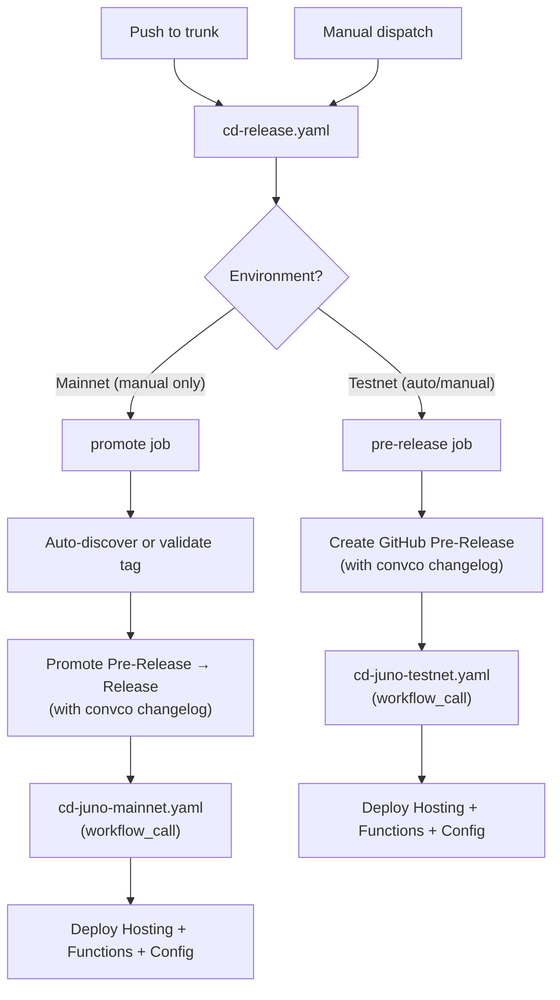
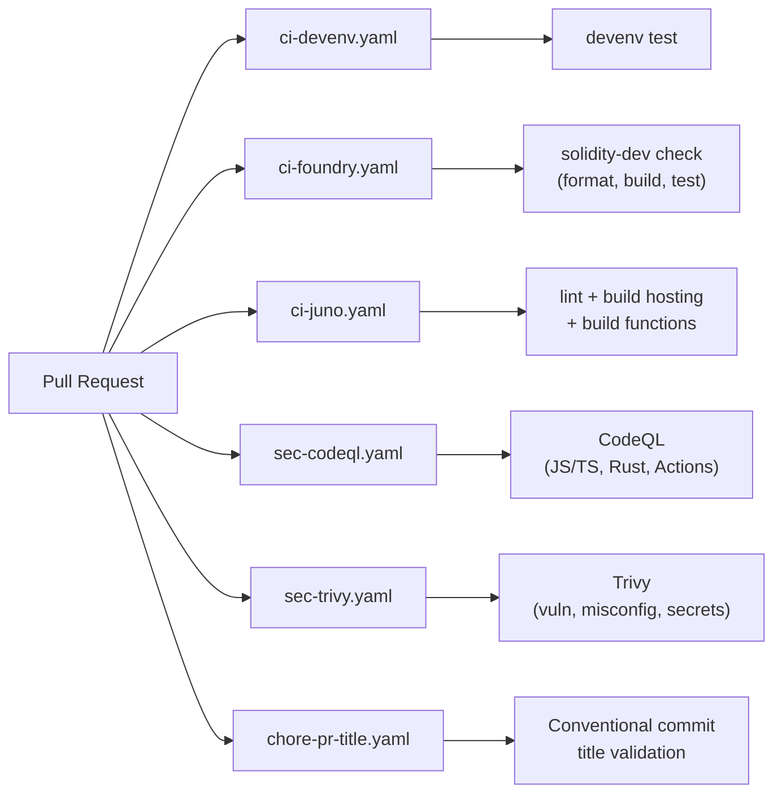

# CI/CD Architecture

## Release Flow



## Developer Workflow

```mermaid
graph LR
    A["Create branch"] --> B["Open PR"]
    B --> C["CI runs<br/>(lint, test, build, security)"]
    C --> D["PR approved"]
    D --> E["Merge queue"]
    E --> F["Merged to trunk"]
    F --> G["Pre-release created<br/>(automatic)"]
    G --> H["Testnet deployed"]
    H --> I["UAT / QA"]
    I --> J["Run cd-release<br/>(Mainnet)"]
    J --> K["Promoted + deployed"]
```



## Manually Runnable Workflows

Only these workflows can be triggered manually via `workflow_dispatch`:

| Workflow                   | Purpose                                           |
| -------------------------- | ------------------------------------------------- |
| `cd-release.yaml`          | Create pre-release (Testnet) or promote (Mainnet) |
| `cd-foundry.yaml`          | Deploy Solidity contracts to Testnet or Mainnet   |
| `chore-devenv-update.yaml` | Update devenv.lock, create PR                     |

All other workflows are triggered automatically by events
(PR, push, merge_group, schedule, workflow_call).

## Mainnet Promotion

When running `cd-release.yaml` with `Environment: Mainnet`:

- **With `release_tag`**: Promotes that specific pre-release
- **Without `release_tag`**: Auto-discovers the latest pre-release and promotes it
- **If latest release is already promoted**: Errors with a helpful message

The GitHub `Mainnet` environment requires manual approval before the promote job runs.

## CI Pipeline



### ci-devenv.yaml

Validates the developer environment builds and tests correctly.
Runs `devenv test` to ensure all Nix dependencies resolve.

### ci-foundry.yaml

Lint and check Solidity contracts via `solidity-dev check`
(format, build, test, Slither).

> [!NOTE]
> No paths filter -- this workflow always runs so that the required
> "Check Contracts" status check is reported on every PR.
> A `detect_changes` step skips the actual check when no contracts changed.

### ci-juno.yaml

Lint, type-check, and build the Juno satellite:

1. `bun run lint` -- ESLint
2. `juno-dev build` -- Astro hosting build
3. `juno-dev build-functions` -- Rust satellite functions

## Foundry Deploy

`cd-foundry.yaml` is a single parameterized workflow that handles
both testnet and mainnet:

- **Push to trunk** (contracts/ changes) -- always deploys to Testnet
- **Manual dispatch** -- choose Testnet or Mainnet

Config values (RPC URL, addresses) are read dynamically from
`config/tresr.yaml` based on the resolved network.

> [!NOTE]
> Only changes inside `contracts/` trigger this workflow.
> Config changes (e.g. `config/tresr.yaml`) do **not** trigger
> a contract redeployment.

### Token + Faucet (Testnet Only)

The `DeployToken.s.sol` script deploys `RonToken` (test ERC-20)
and `TresrFaucet`. This step is gated to Testnet only via an
`if` condition.

### Vault (Deploy vs Upgrade)

The pipeline auto-detects whether to do a **fresh deploy** or an
**upgrade** based on the `vault_contract` address in
`config/tresr.yaml`:

| `vault_contract` value     | Pipeline action                                  |
| -------------------------- | ------------------------------------------------ |
| Zero address (`0x0000...`) | Fresh deploy via `Vault.s.sol` (impl + proxy)    |
| Non-zero address           | Upgrade via `UpgradeVault.s.sol` (new impl only) |

#### Fresh Deploy (first time)

1. `Vault.s.sol` deploys the `TresrVault` implementation and
   an `ERC1967Proxy`
2. The proxy address appears in the GitHub Actions job summary
3. **You must update `vault_contract` in `config/tresr.yaml`
   with the proxy address**
4. Push the config change (this does NOT re-trigger contract deployment)

#### Upgrade (subsequent changes)

1. `UpgradeVault.s.sol` deploys a new implementation contract
2. The GitHub Actions job summary shows a **Safe Transaction** section
   with the proxy address, new implementation address, and the
   `upgradeToAndCall` calldata
3. A Safe signer pastes the calldata into the Gnosis Safe
   Transaction Builder

> [!IMPORTANT]
> The CI deployer EOA **cannot** execute the upgrade.
> The `_authorizeUpgrade` function on `TresrVault` requires
> `DEFAULT_ADMIN_ROLE`, which belongs to the Gnosis Safe multisig.
> The pipeline only deploys the new code -- a multisig signer must
> approve the actual upgrade.

### Multisig Upgrade Steps

1. Open the GitHub Actions run for the CD workflow
2. Scroll to the **job summary** -- the Safe transaction details
   are displayed there
3. In the Gnosis Safe UI -- **Transaction Builder** -- **Custom data**:
   - **To**: the proxy address (shown in summary)
   - **Value**: `0`
   - **Data**: paste the calldata from the summary
4. Submit and collect required signatures
5. Once executed, the proxy points to the new implementation

> [!CAUTION]
> After the very first deploy, you **must** update `config/tresr.yaml`
> with the real proxy address before the next push to `contracts/`.
> Otherwise the pipeline will deploy a brand new proxy, creating an
> orphaned vault.

## Juno Deploy

### cd-juno-testnet.yaml

Called by `cd-release.yaml` after a successful pre-release.
Deploys hosting, config, and (if changed) serverless functions
to `staging` mode.

Steps:

1. Parse release tag and set version
2. Detect function changes (diff against previous tag)
3. Build functions (only if changed)
4. `juno hosting deploy --mode staging`
5. `juno config apply --force --mode staging`
6. `juno functions publish --mode staging` (only if changed)

### cd-juno-mainnet.yaml

Called by `cd-release.yaml` after a successful promotion.
Same structure as testnet but deploys in `production` mode.

## Security Scanning

### sec-codeql.yaml

CodeQL static analysis for security vulnerabilities.
Scans JavaScript/TypeScript, Rust, and GitHub Actions workflows.
Runs on PR, push, merge_group, and weekly schedule.
Results uploaded to the GitHub Security tab.

### sec-trivy.yaml

Trivy filesystem scan for vulnerabilities, misconfigurations,
exposed secrets, and license compliance.
Runs on PR (except docs-only changes), merge_group, and weekly.
Results uploaded as SARIF to GitHub Security.

## Housekeeping

### chore-devenv-update.yaml

Runs weekly (Sunday 00:00 UTC) or on manual dispatch.
Updates devenv dependencies (`devenv update`), runs tests,
and creates a PR with the updated `devenv.lock`.

### chore-pr-title.yaml

Enforces conventional commit format on PR titles
(`type(scope): description`). Required for clean changelogs
and correct semantic version bumps via `convco`.

### comments.yaml

Reacts to issue comments with Giphy responses and optionally
forwards to Discord (gated by the `ENABLE_DISCORD` variable).

## Environment Configuration

Contract addresses are read from `config/tresr.yaml` at deploy time:

```yaml
client:
  blockchain:
    avalanche:
      testnet:
        vault_contract: "0x..." # Proxy address (set after first deploy)
        faucet_contract: "0x..." # Set after first testnet deploy
        tresr_token_contract: "0x..."
        oracle_address: "0x..."
        safe_address: "0x..." # Gnosis Safe multisig
      mainnet:
        vault_contract: "0x..."
        tresr_token_contract: "0x..."
        # ...
```

## Secrets

| Secret                            | Purpose                                       |
| --------------------------------- | --------------------------------------------- |
| `DEPLOYER_PRIVATE_KEY`            | EOA wallet for broadcasting deploy txns       |
| `SNOWTRACE_API_KEY`               | Contract verification on Snowtrace            |
| `JUNO_TOKEN`                      | Juno CLI auth for hosting/functions/config    |
| `PUBLIC_WALLETCONNECT_PROJECT_ID` | WalletConnect Cloud project ID                |
| `GIPHY_TOKEN`                     | Giphy API key for comment reactions           |
| `WEBHOOK_DISCORD`                 | Discord webhook URL for comment notifications |
| `DAISYUI_LICENSE`                 | DaisyUI commercial license                    |
| `DAISYUI_EMAIL`                   | DaisyUI account email                         |

## Custom Actions

| Action            | Purpose                                     |
| ----------------- | ------------------------------------------- |
| `cache-bun`       | Cache Bun package manager dependencies      |
| `cache-cargo`     | Cache Cargo/Rust build artifacts            |
| `cache-foundry`   | Cache Foundry build artifacts               |
| `free-disk-space` | Free disk space on GitHub-hosted runners    |
| `report-status`   | Report workflow status to commit checks     |
| `setup-devenv`    | Install and configure devenv with Cachix    |
| `setup-juno`      | Install Juno CLI                            |
| `version`         | Manage version bumping across project files |

## Workflow Inventory

| Workflow                   | Prefix | Trigger                         | Purpose                                  |
| -------------------------- | ------ | ------------------------------- | ---------------------------------------- |
| `cd-release.yaml`          | cd     | push to trunk, dispatch         | Create pre-release or promote to release |
| `cd-juno-testnet.yaml`     | cd     | workflow_call only              | Deploy Juno to Testnet                   |
| `cd-juno-mainnet.yaml`     | cd     | workflow_call only              | Deploy Juno to Mainnet                   |
| `cd-foundry.yaml`          | cd     | push (contracts/), dispatch     | Deploy Solidity contracts                |
| `ci-devenv.yaml`           | ci     | pull_request, merge_group       | Test devenv shell                        |
| `ci-foundry.yaml`          | ci     | pull_request, merge_group       | Lint and check Solidity                  |
| `ci-juno.yaml`             | ci     | pull_request, merge_group       | Build and check Juno                     |
| `chore-devenv-update.yaml` | chore  | schedule (weekly), dispatch     | Update devenv.lock, create PR            |
| `chore-pr-title.yaml`      | chore  | pull_request                    | Validate conventional commit PR titles   |
| `sec-codeql.yaml`          | sec    | PR, push, merge_group, schedule | CodeQL security analysis                 |
| `sec-trivy.yaml`           | sec    | PR, merge_group, schedule       | Trivy vulnerability scanning             |
| `comments.yaml`            | --     | issue_comment                   | Handle slash commands in comments        |

## Naming Conventions

| Element           | Convention                                 | Example                    |
| ----------------- | ------------------------------------------ | -------------------------- |
| Workflow filename | `{ci\|cd\|chore}-{component}[-{env}].yaml` | `chore-devenv-update.yaml` |
| Workflow `name:`  | Title Case                                 | `Juno Deploy (Testnet)`    |
| Job ID            | `kebab-case`                               | `deploy-juno-testnet`      |
| Job `name:`       | Title Case                                 | `Deploy Juno (Testnet)`    |
| Step ID           | `snake_case`                               | `setup_devenv`             |
| Step `name:`      | Title Case Verb-Noun                       | `Setup Devenv`             |
| Action inputs     | `kebab-case`                               | `github-token`             |
| File extension    | `.yaml`                                    | --                         |
