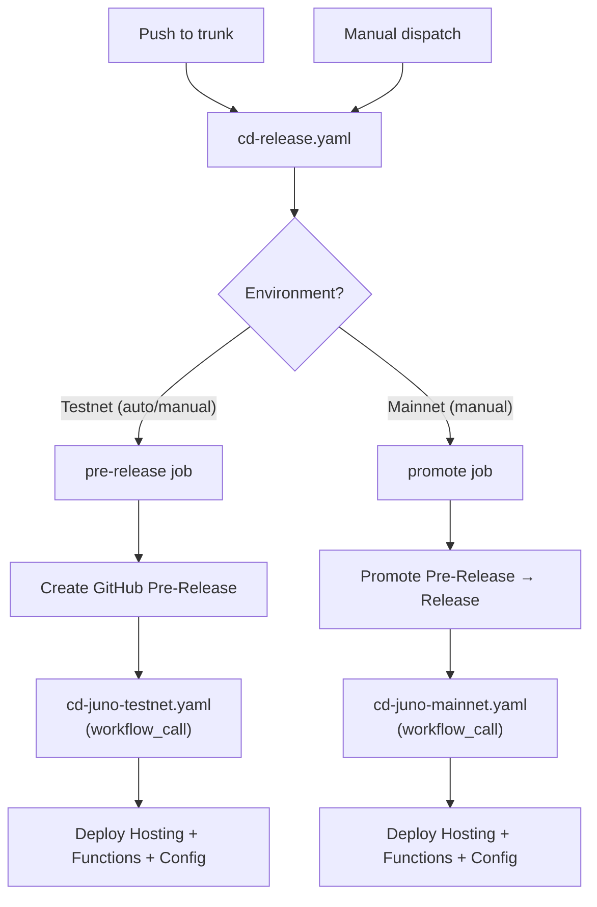
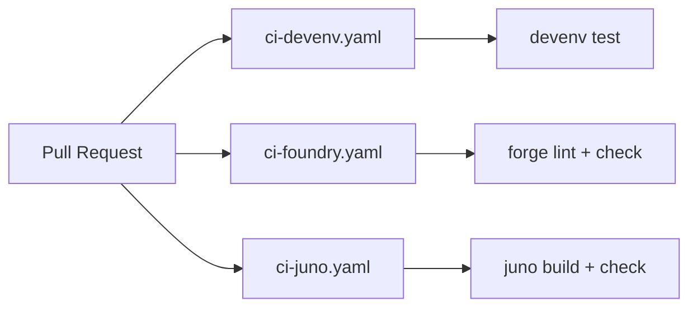

# CI/CD Architecture

## Release Flow

## CI Pipeline

## `workflow_call` Design

Deploy workflows (`cd-juno-testnet.yaml`, `cd-juno-mainnet.yaml`) accept both `workflow_call` and `workflow_dispatch` triggers:

- **`workflow_call`** — called by `cd-release.yaml` after creating/promoting a release. Version is passed as input. Uses `secrets: inherit`.
- **`workflow_dispatch`** — manual fallback for re-deploying a specific version.

This replaces the previous event-based chaining (`release: types: [prereleased/released]`), which required a Personal Access Token because `GITHUB_TOKEN` events don't trigger further workflows.

## Foundry Deploy

`cd-foundry.yaml` is a single parameterized workflow that handles both testnet and mainnet:

- **Push to trunk** (contracts/ changes) → always deploys to Testnet (Fuji)
- **Manual dispatch** → choose Testnet or Mainnet

Config values (RPC URL, addresses) are read dynamically from `config/tresr.yaml` based on the resolved network.

## Workflow Inventory

| Workflow                   | Prefix | Trigger                     | Purpose                                  |
| -------------------------- | ------ | --------------------------- | ---------------------------------------- |
| `cd-release.yaml`          | cd     | push to trunk, dispatch     | Create pre-release or promote to release |
| `cd-juno-testnet.yaml`     | cd     | workflow_call, dispatch     | Deploy Juno to Testnet                   |
| `cd-juno-mainnet.yaml`     | cd     | workflow_call, dispatch     | Deploy Juno to Mainnet                   |
| `cd-foundry.yaml`          | cd     | push (contracts/), dispatch | Deploy Solidity contracts                |
| `ci-devenv.yaml`           | ci     | pull_request                | Test devenv shell                        |
| `ci-foundry.yaml`          | ci     | pull_request                | Lint and check Solidity                  |
| `ci-juno.yaml`             | ci     | pull_request                | Build and check Juno                     |
| `chore-devenv-update.yaml` | chore  | schedule (weekly), dispatch | Update devenv.lock, create PR            |
| `comments.yaml`            | —      | issue_comment               | Handle slash commands in comments        |

## Naming Conventions

| Element           | Convention                                 | Example                    |
| ----------------- | ------------------------------------------ | -------------------------- |
| Workflow filename | `{ci\|cd\|chore}-{component}[-{env}].yaml` | `chore-devenv-update.yaml` |
| Workflow `name:`  | Title Case                                 | `Juno Deploy (Testnet)`    |
| Job ID            | `kebab-case`                               | `deploy-juno-testnet`      |
| Job `name:`       | Title Case                                 | `Deploy Juno (Testnet)`    |
| Step ID           | `snake_case`                               | `setup_devenv`             |
| Step `name:`      | Title Case Verb-Noun                       | `Setup Devenv`             |
| Action inputs     | `kebab-case`                               | `github-token`             |
| File extension    | `.yaml`                                    | —                          |
