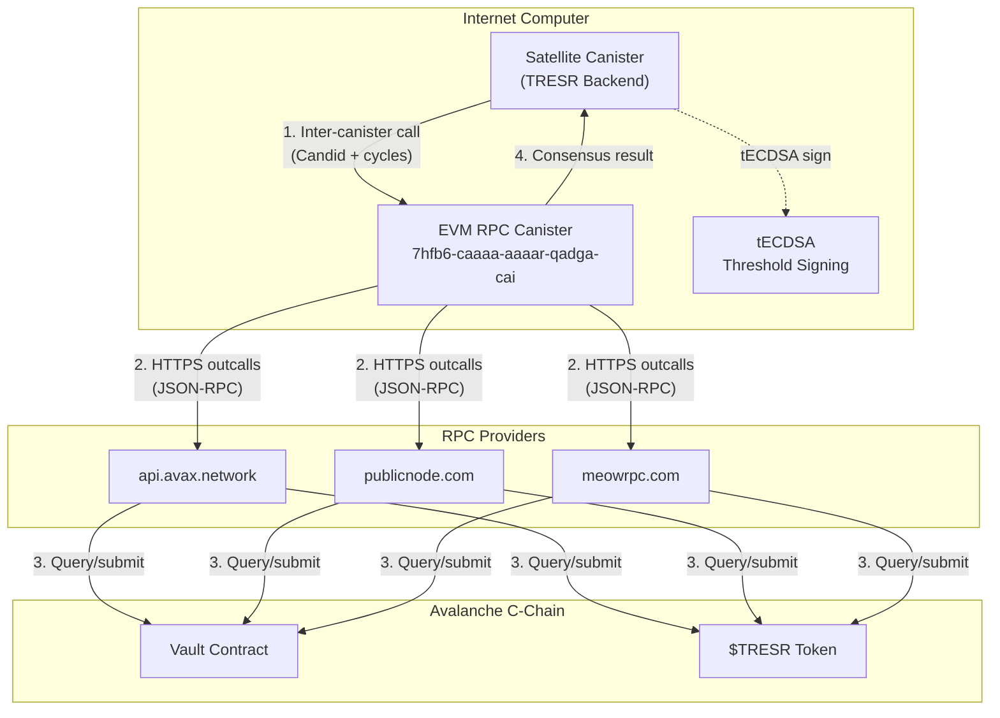
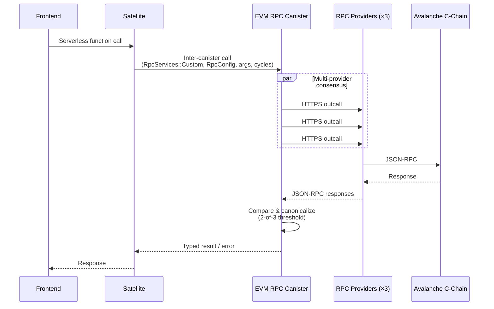

# EVM RPC Canister

The [EVM RPC canister](https://internetcomputer.org/docs/building-apps/chain-fusion/ethereum/evm-rpc/overview) (`7hfb6-caaaa-aaaar-qadga-cai`) is a DFINITY-maintained ICP canister.

The canister proxies JSON-RPC requests to EVM blockchains via HTTPS outcalls.

TRESR uses it as the **sole bridge** between the satellite canister and the Avalanche C-Chain.

## Architecture



## Call Flow

Every Avalanche interaction follows the same pattern:



## Operations

The satellite uses the EVM RPC canister for the following operations, implemented in [`evm_rpc.rs`](../src/satellite/src/evm_rpc.rs):

### Read Operations

| Operation              | EVM RPC Method                                | Purpose                                                                |
| ---------------------- | --------------------------------------------- | ---------------------------------------------------------------------- |
| **Verify fee payment** | `eth_getTransactionReceipt` + `multi_request` | Confirm a player's `payFee()` tx succeeded and matches expected params |
| **Verify claim**       | `eth_getTransactionReceipt` + `multi_request` | Confirm a `claim()` tx is valid before updating game state             |
| **Token balance**      | `eth_call`                                    | Read `$TRESR` `balanceOf()` for vault cap checks and player balances   |
| **Transaction count**  | `eth_getTransactionCount`                     | Get nonce for building signed outbound transactions                    |
| **Gas price**          | `multi_request` (`eth_gasPrice`)              | Dynamic gas estimation for outbound transactions                       |
| **Gas estimate**       | `multi_request` (`eth_estimateGas`)           | Size outbound transactions correctly                                   |

### Write Operations

| Operation          | EVM RPC Method           | Purpose                                               |
| ------------------ | ------------------------ | ----------------------------------------------------- |
| **Send signed tx** | `eth_sendRawTransaction` | Submit tECDSA-signed withdrawal transactions (future) |

## RPC Services Configuration

Avalanche C-Chain is **not** a built-in chain in the EVM RPC canister. We use `RpcServices::Custom` with explicit RPC URLs:

```rust
use evm_rpc_canister_types::*;

let services = RpcServices::Custom {
    chain_id: 43114, // Avalanche C-Chain mainnet (43113 for Fuji testnet)
    services: vec![
        RpcApi { url: "https://api.avax.network/ext/bc/C/rpc".into(), headers: None },
        RpcApi { url: "https://avalanche-c-chain-rpc.publicnode.com".into(), headers: None },
        RpcApi { url: "https://avax.meowrpc.com".into(), headers: None },
    ],
};

let config = Some(RpcConfig {
    response_size_estimate: Some(3000),
    response_consensus: Some(ConsensusStrategy::Threshold {
        total: Some(3),
        min: 2,
    }),
});
```

The RPC URLs are configured per-environment in [`config/tresr.yaml`](../config/tresr.yaml):

- **Anvil**: `http://localhost:8545` (single provider, no consensus)
- **Testnet (Fuji)**: 2–3 Fuji RPC endpoints
- **Mainnet**: 3 Avalanche mainnet RPC endpoints

## Typed vs Raw Requests

The EVM RPC canister exposes two categories of endpoints:

### Typed Methods (Preferred)

These accept structured Candid arguments and return typed results:

| Method                      | Args                                                                | Returns                            |
| --------------------------- | ------------------------------------------------------------------- | ---------------------------------- |
| `eth_getTransactionReceipt` | `(RpcServices, Option<RpcConfig>, hash: String)`                    | `MultiGetTransactionReceiptResult` |
| `eth_getTransactionCount`   | `(RpcServices, Option<RpcConfig>, GetTransactionCountArgs)`         | `MultiGetTransactionCountResult`   |
| `eth_call`                  | `(RpcServices, Option<RpcConfig>, CallArgs)`                        | `MultiCallResult`                  |
| `eth_sendRawTransaction`    | `(RpcServices, Option<RpcConfig>, rawSignedTransactionHex: String)` | `MultiSendRawTransactionResult`    |
| `eth_getLogs`               | `(RpcServices, Option<RpcConfig>, GetLogsArgs)`                     | `MultiGetLogsResult`               |
| `eth_getBlockByNumber`      | `(RpcServices, Option<RpcConfig>, BlockTag)`                        | `MultiGetBlockByNumberResult`      |
| `eth_feeHistory`            | `(RpcServices, Option<RpcConfig>, FeeHistoryArgs)`                  | `MultiFeeHistoryResult`            |

### Raw JSON-RPC (`multi_request`)

For methods without typed wrappers (e.g. `eth_gasPrice`, `eth_estimateGas`, `eth_getTransactionByHash`):

```rust
let json = r#"{"jsonrpc":"2.0","method":"eth_gasPrice","params":[],"id":1}"#;

let (result,): (MultiJsonRequestResult,) = evm_rpc
    .multi_request(services, config, json.to_string(), cycles)
    .await;
```

## Cycles Cost

Every EVM RPC call requires **cycles** paid by the calling canister. Approximate costs (34-node fiduciary subnet):

| Call Type                                           | Estimated Cost       |
| --------------------------------------------------- | -------------------- |
| Simple read (`eth_call`, `eth_getTransactionCount`) | ~1B cycles (~$0.001) |
| Receipt lookup (`eth_getTransactionReceipt`)        | ~2B cycles           |
| Send transaction (`eth_sendRawTransaction`)         | ~3B cycles           |
| Raw JSON-RPC (`multi_request`)                      | ~1-3B cycles         |

Use `call_with_payment128()` or the `EvmRpcCanister` helper which handles cycle attachment automatically.

## Rust Crate

The [`evm-rpc-canister-types`](https://docs.rs/evm-rpc-canister-types/) crate provides all Candid types and an `EvmRpcCanister` client struct:

```toml
[dependencies]
evm-rpc-canister-types = "5"
```

```rust
use evm_rpc_canister_types::*;

let evm_rpc = EvmRpcCanister(evm_rpc_principal);

// Typed call — returns TransactionReceipt directly
let receipt = evm_rpc
    .eth_get_transaction_receipt(services, config, tx_hash, cycles)
    .await;

// Raw JSON-RPC — returns JSON string
let gas_price = evm_rpc
    .multi_request(services, config, json_payload, cycles)
    .await;
```

## Local Development (Anvil)

When `NETWORK_NAME == "anvil"`, the satellite **skips** the EVM RPC canister entirely and is tested against a local Anvil instance. The EVM RPC canister is only used for testnet and mainnet deployments.

## References

- [EVM RPC Overview](https://internetcomputer.org/docs/building-apps/chain-fusion/ethereum/evm-rpc/overview)
- [EVM RPC Costs](https://internetcomputer.org/docs/building-apps/chain-fusion/ethereum/evm-rpc/costs)
- [EVM RPC Samples](https://internetcomputer.org/docs/building-apps/chain-fusion/ethereum/evm-rpc/samples)
- [Candid Interface (evm_rpc.did)](https://github.com/internet-computer-protocol/evm-rpc-canister/blob/main/candid/evm_rpc.did)
- [Rust Crate (evm-rpc-canister-types)](https://docs.rs/evm-rpc-canister-types/)
- [GitHub Repository](https://github.com/internet-computer-protocol/evm-rpc-canister)
