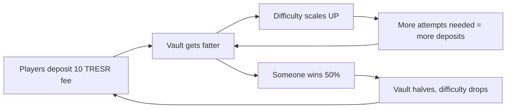

# FOMO Game Loop — Economic Design

## Overview

The goal for the TresrVault is to create a self-sustaining economic flywheel where;

- players deposit $TRESR to play
- winners drain a portion of the vault
- and the cycle repeats.

No manual refilling should be required after the initial seed.

## The Flywheel



## Vault Tiers & Difficulty

All values denominated in whole $TRESR tokens (18 decimals).

| Tier        | Vault Balance    | Difficulty | Color     | Behaviour                               |
| ----------- | ---------------- | ---------- | --------- | --------------------------------------- |
| **LOCKED**  | < 500            | N/A        | ⚫ Grey   | Paid mode disabled. "Vault recharging"  |
| **Easy**    | 500 – 5,000      | 0.6x       | 🟢 Green  | Attracts players, vault refills quickly |
| **Normal**  | 5,000 – 25,000   | 1.0x       | 🟡 Yellow | Balanced gameplay                       |
| **Hard**    | 25,000 – 100,000 | 1.5x       | 🔴 Red    | FOMO zone: big prize, hard to claim     |
| **Extreme** | > 100,000        | 2.0x       | 🟣 Purple | Legendary territory                     |

### Difficulty Multiplier Effects

The multiplier adjusts (future implementation in satellite):

- Enemy health and damage
- Boss health and enrage threshold
- Enemy spawn rate

## Caps & Guards

| Parameter         | Value                 | Rationale                              |
| ----------------- | --------------------- | -------------------------------------- |
| Deposit fee       | 10 TRESR              | Low barrier, steady inflow             |
| Burn rate         | 10% of deposit        | Deflationary — 1 TRESR burned per play |
| Max claim         | 50% of vault          | Vault never fully drains               |
| Minimum claim     | 50 TRESR              | Prevents dust claims                   |
| Claim cooldown    | 1 hour (configurable) | Per-user limit, daily race mechanic    |
| Minimum vault cap | 500 TRESR             | Below this, paid mode is locked        |

## Win Economics Example

Starting vault: 100,000 TRESR

```text
Round 1: Player A wins → claims 50,000 → vault: 50,000
Round 2: Player B wins → claims 25,000 → vault: 25,000
Round 3: Player C wins → claims 12,500 → vault: 12,500
Round 4: Player D wins → claims  6,250 → vault:  6,250
Round 5: Player E wins → claims  3,125 → vault:  3,125
Round 6+: Deposits accumulate, vault refills...
```

Meanwhile, every losing player deposited 10 TRESR (9 to vault + 1 burned).

At 100 losing plays between wins, that's +900 TRESR back to the vault.

## Homepage UX

### Vault Balance (center, prominent)

- Animated counter showing current vault TRESR balance
- Difficulty badge next to it (🟢/🟡/🔴/🟣)
- Updates every 60 seconds via RPC polling

### Cooldown Timer

- Shows personal cooldown: "Next claim in 00:45:22" or "READY ✅"
- Only visible for authenticated, wallet-connected users

### START Button Lock

- When vault < 500 TRESR: START button disabled with "VAULT RECHARGING" label
- When user cooldown active: START button shows cooldown remaining

### Win Toast (FOMO)

- Listens for `Claim` events on-chain
- Shows toast: "🏆 0x1234...5678 just won 37,500 TRESR!"
- Auto-refreshes vault balance on win event

## Config Values

Added to `tresr.yaml` under `gameplay.vault`:

```yaml
vault:
  minimum_cap: 500 # Below this, paid mode is locked
  tiers:
    easy: 5000 # 500 - 5,000
    normal: 25000 # 5,000 - 25,000
    hard: 100000 # 25,000 - 100,000
    extreme: 100001 # > 100,000
  difficulty_multipliers:
    easy: 0.6
    normal: 1.0
    hard: 1.5
    extreme: 2.0
```
