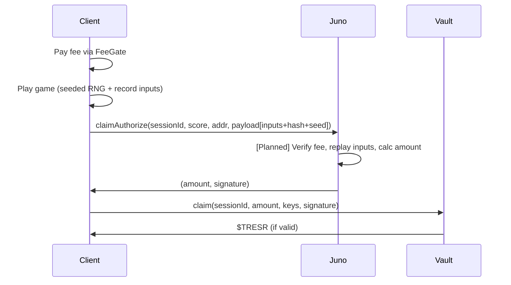

# Tresr Game Design and Technical Specification

**Version:** 2.5

## Table of Contents

- [Overview](#overview)
- [Win Mechanics](#win-mechanics)
- [Architecture](#architecture-hybrid-client-server-with-on-chain-settlement)
  - [Technology Stack](#components-and-technology-stack)
  - [Economy Flow](#economy-flow)
  - [Data Layer](#data-layer)
- [Phaser Engine Architecture](#phaser-engine-architecture)
  - [Scene Structure](#scene-structure)
  - [Entity System](#entity-system)
  - [Combat System](#combat-system)
  - [Super Attack Mechanic](#super-attack-mechanic)
  - [2.5D Physics Engine](#25d-physics-engine)
  - [Object Pooling](#object-pooling)
  - [Seeded RNG & Input Recording](#seeded-rng--input-recording)
  - [SpriteManager](#spritemanager)
  - [Event-Driven Architecture](#event-driven-architecture)
  - [Lifecycle Management](#lifecycle-management)
- [Audio System](#audio-system)
- [Configuration Pipeline](#configuration-pipeline)
- [Security Model](#security-model)
- [Frontend Components](#frontend-components)
- [UI/UX & Theming](#uiux--theming)
- [PWA Architecture](#pwa-architecture)
- [Content Management](#content-management)
- [Asset Storage Guidelines](#asset-storage-guidelines)
- [Analytics](#analytics)

## Changelog

- **v2.5**: Renamed "Candle" entity to "Bomb" throughout codebase and config.
  Config hash critical values now include `audio` field. Config hash verification
  is now blocking (game stops on mismatch with visible error). Anti-cheat ban
  system implemented with device-level persistence (applies to guest users too).
  Fee gate security hardened with HMAC signature verification and transaction
  receipt confirmation. VaultBalance component implemented with wallet connection
  guard (only polls RPC when Avalanche wallet connected). Notification persistence
  uses serialized write queue to prevent Juno version conflicts. Centralized
  logging system enforced (`src/lib/utils/log.ts`). Guest rate limiting with
  configurable plays-per-day and cooldown modal. Scrolling typewriter text on
  loading screen. Combat distance calculations use `groundY` (not visual `y`)
  for correct 2.5D depth-plane distances. Damage values rounded to prevent
  fractional HP. Enemy X-axis clamping prevents off-screen movement.
  Comprehensive event listener and store subscription cleanup for Astro View
  Transitions. XSS vulnerabilities fixed via safe DOM APIs. Multiple memory leak
  fixes (audio elements, timers, tweens, physics bodies).
- **v2.4**: Loot drop system with 5 health pickup variants (soda can, milkshake, water bottle, hamburger, french fries) and 5 powerup
  variants (energy can blue, coffee mug, red bull, red bull no sugar, takeaway coffee cup). Intro narration voiceover during loading screen
  with user preference toggle (`narration?: boolean` on UserProfile). Sprite standardization to 512x512 base frames with special sizes for
  jump/super/key/bomb/loader. Narration audio stored at `public/assets/audio/narration/`. Updated MusicPlayer with narration checkbox for
  logged-in users. Prebuild step added to juno-dev lint command.
- **v2.3**: Enemy AI enhancements — added 3 new AI types (ranged, swarm, burrower) with weighted random selection.
  Boss phase system with Phase 2 enrage at 50% HP. Boss special attacks: ground pound AoE, charge rush, enemy summon.
  All new values config-driven via `entities.enemy.ai` and `entities.boss.phases`/`entities.boss.attacks`.
- **v2.2**: Entity-centric config schema restructure — all entity config now lives under `gameplay.entities.<name>` instead of scattered across
  `stats`, `combat`, `physics.hitboxes`, `spawners`, `animations`, `spawn`, `super_attack`. Updated all config path references throughout spec.
  Removed dead config keys (`scoring.candle_hit`, `stats.enemies.candle.health`).
  Updated design principle #4 from "Nested YAML Convention" to "Entity-Centric Organization".
- **v2.1**: Added nested YAML convention (design principle #4), restructured AI config references from flat prefixed keys to nested personality
  objects. Added anti-cheat ban system: `banned_until` + `offence_count` on user profile, escalating bans (24h/72h/168h/permanent),
  ban check at game start and claim time. Updated Security Model tables with ban enforcement and repeat cheating mitigation.
- **v2.0**: Major rewrite aligning spec with implemented codebase. Added: Bomb entity, enemy AI system, 2.5D physics engine, color-coded
  health bars, seeded RNG, input recorder, config hash anti-cheat, object pooling, camera shake effects, SFX variants, FeeGate, WalletLink,
  loading screen, music shuffle persistence, hitbox configs, frontend component documentation, audio system section, configuration pipeline
  section. Corrected: controls table, scoring system, super attack (now fully implemented), entity descriptions.
  Marked unimplemented features as [Planned].
- **v1.2**: Added super attack, updated config to tresr.yaml schema, enhanced UI descriptions, integrated PWA optimizations, expanded theming/navigation.

## Overview

Tresr is a 2.5D beat-em-up where retro 80s action movie-style characters, inspired by Streets of Rage, battle in a cyberpunk Tron-inspired battle grid environment featuring electric grid lines.

The game uses "Streets of Rage" style depth sorting (`setDepth(groundY)`) with Z-axis physics to simulate 3D space on a 2D plane.
All entities have shadow rendering, and floating entities (keys, bombs, boss during descent) use Z-axis gravity for natural-looking vertical motion.

The protagonist, Ron Jay, is a crypto degenerate hero wearing 70s-style clothing with a moustache, fighting against evil bankers
(businessmen in suits) who are anti-cryptocurrency. Five visually distinct enemy variants share the same mechanics but have four different
AI behavior types (direct, flanker, cautious, erratic).

The core mechanics: Degens survive an endless hoard of enemies for 5 minutes while optionally collecting dropped yellow keys and dodging
falling bombs (environmental hazards that damage both enemies and the player).

Upon timer expiration, all basic enemies are cleared and the final boss Gary Gensler descends from above. If the boss is defeated, a treasure chest appears and the Degen can claim $TRESR rewards.

When logged in, Degens pay a $TRESR fee to join the vault pot; otherwise, guest mode provides a demo without tokens.

## Win Mechanics

- **Bear Market (survival phase)**: Degens survive an endless hoard of enemies for exactly 5 minutes (config: `time_limit_seconds: 300`).
  Varying numbers of enemies spawn from screen edges every 2 seconds (config: `entities.enemy.spawner.delay_ms`),
  with up to 50 concurrent (config: `entities.enemy.spawner.pool_size`). Bombs also drop periodically from above
  (every 5 seconds, max 15 concurrent).
- **Optional Key Collection**: Yellow keys airdrop from above with parachute physics (reduced gravity, horizontal drift with sine-wave
  oscillation). They bounce on landing and fade after 3 seconds on the ground. Collecting keys boosts rewards.
- **Bull Market (boss fight)**: Timer expires at 0:00, all basic enemies will leave the screen, and boss Gary Gensler descends slowly from above
  (speed: `entities.boss.descent.speed`). Boss is invincible during descent. Once at ground level
  (`entities.boss.descent.threshold`), boss enters fighting state and pursues the player.
- **Win Condition**: Defeat the boss, then punch-open the central treasure chest to claim reward. The chest plays an open animation and emits `game_win` to trigger the claim flow.
- **Reward Formula**: [Planned] Claim percentage of vault = `(keys_collected / 150) * 50%`, capped at 50% vault. Oracle-enforced.
- **Loss Condition**: Player dies (HP reaches 0) during survival or boss phase. Lose fee (if logged in), vault pot grows; end session.
- **On Loss**: Display themed DaisyUI Game Over modal with stats and auto-save high score. Stats are saved to Juno Collection storage.
- **Scoring**: Config-driven scoring system:
  - Key collection: 100 points (config: `scoring.key_collection`)
  - Enemy kill: 10 points (config: `scoring.enemy_kill`)
  - Boss hit: 50 points (config: `scoring.boss_hit`)
  - Super hit: 20 points (config: `scoring.super_hit`)
  - Bomb hit: 0 points (no config — bomb explosions never score)
- **Difficulty Scaling**: [Planned] Boss HP and attack power scale based on vault balance: `difficulty = floor(log10(vault_balance / 1e18)) + 1`.
- **Cooldown**: [Planned] 24 hours per player between claims.

## Art

All art assets use game sprites stored in `public/assets/sprites`.

Sprite sheets use row-based animation layouts:

- Row 1: Idle, Row 2: Walk, Row 3: Jump, Row 4: Attack, Row 5: Hurt, Row 6: Super (hero only)

Sprites: Per-entity WebP sheets in `public/assets/sprites/{entity}/{animation}.webp`.

Frame dimensions are config-driven per sprite (defaults: 512x512). Special sizes:

- Hero super: 1024x512 (wide frame for fireball effect)
- Jump animations (hero, boss, enemies): 512x1024 (tall frame for vertical movement)
- Key/Bomb: 512x1024 (tall frame, scaled to 0.25 in-game)
- Loader: 1024x1024 (scaled to 0.5 in-game)
- Chest: 512x512 (scaled to 2.0 in-game)

## Tokens

- **$TRESR (Mainnet):** 0x9913BA363073Ca3e9eA0cD296E36B75aF9E40bef (18 decimals)
- **$tTRESR (Testnet):** 0x6EB523A381e725F115b7454BaA3cb199E4770970 (18 decimals)

## Architecture: Hybrid Client-Server with On-Chain Settlement

Tresr uses a hybrid architecture to ensure responsive gameplay while maintaining tamper-proof verification and immutable fund settlement.

### Components and Technology Stack

- **Frontend (Astro/Phaser/TypeScript)**:
  - **Astro**: Handles the "App" layer (Landing, Auth, Profile, Wallet, HUD, FeeGate, Modals).
  - **Phaser v3**: Handles the "Game" layer (Canvas, Physics, Audio, Input) with Arcade Physics.
  - **TypeScript**: Strict typing enforced across both App and Game layers.
  - **DaisyUI v5 + TailwindCSS v4**: DaisyUI-first styling for all HTML/Astro components.
    DaisyUI prebuilt components are preferred; Tailwind utilities used only for layout
    and spacing where DaisyUI lacks coverage. Custom CSS is prohibited except for game-specific
    visual effects with no DaisyUI/Tailwind equivalent.
  - **Nanostores**: Reactive state management (`gameStore`) bridging Phaser and Astro.
  - **2.5D Rendering**: Z-axis physics with gravity, depth sorting via `setDepth(groundY)`, shadow rendering for all entities.
- **Backend (Juno - Rust Canisters)**: Manages authentication via Internet Identity 2.0, database operations using Juno Collections,
  verification of game sessions, oracle functions for claims, and version information.
- **Settlement (Avalanche C-Chain)**: Holds the $TRESR vault via Vault.sol smart contract. Uses Wagmi for wallet connections (e.g., WalletConnect, MetaMask).
- **Notifications**: Persistent system via Juno Datastore + Nanostores for reactive UI.
- **Logging**:
  - All source code uses centralized logging system via `src/lib/utils/log.ts`.
  - API: `log.info(component, message, ...args)`, `log.warn()`, `log.error()`, `log.debug()`.
  - Format: `[COMPONENT] [LEVEL] Message`.
  - Colour: Logs are coloured based on log level from GREEN to RED.
  - Direct `console` calls are prohibited in source code in favor of `log`.

### Folder Layout and Component Organization

```text
src/
  components/
    game/         # HUD, GameModals, FeeGate, PauseMenu, LeaderboardModal, MusicPlayer, PhaserGame
    wallet/       # WalletLink
    ui/           # Shared UI components
  lib/
    auth/         # Authentication (IID, SIWA, WebAuthn, guest)
    config/       # Configuration loading and caching
    game/
      prefabs/    # BaseEntity, Player, Enemy, Boss, Key, Bomb, Chest, SuperProjectile
      scenes/     # BootScene, Preloader, MainScene
      MusicManager.ts
      SpriteManager.ts
      Recorder.ts
      store.ts
      constants.ts
      game.ts     # Phaser config and initialization
    notifications/
    utils/        # log.ts, helpers
    wallet/       # Avalanche integration, contract interaction
    metrics/      # Analytics
  pages/
    game.astro    # Game page with FeeGate and Phaser canvas
  types/
    config.ts     # Auto-generated from tresr.yaml
```

### Economy Flow

#### Fee Flow (Entry Fee)

1. **User Link**: User connects EVM wallet and signs a message to link it to their Juno Principal ID.
2. **User Action**: User clicks "Start Game" when logged in. The FeeGate component prompts for a fee payment.
3. **Avalanche Tx**: User signs a fee transaction. [Planned: `payFee(amount, sessionId)` on `Vault.sol`]. Currently uses message signing as placeholder.
   - `sessionId` is generated client-side via `crypto.randomUUID()`. [Planned: deterministic hash `SHA256(clientGeneratedSeed + timestamp + principal)`].
   - [Planned] A percentage (10%) of the fee is burned as an anti-inflation measure.
4. **Session Start**: Fee paid status stored in `sessionStorage`. Game session begins.
   - [Planned] Juno verifies txHash via Avalanche RPC and creates a "Game Session" record.

#### Gameplay Mechanics

1. **Session Start**: If logged in, FeeGate prompts EVM wallet fee payment (fee configured per chain in `blockchain.avalanche.[env].fee`). Guest mode: Start directly without fee.
2. **Bear Market (survival phase)**: 5-minute countdown. Enemies spawn from screen edges (5 variants, 4 AI types). Keys airdrop with parachute physics.
   Bombs fall and explode on impact. Player moves/jumps/attacks. Inputs recorded via `Recorder`.
3. **Bull Market (boss phase)**: Timer expires, all enemies cleared, boss descends from above. Fight boss while dodging bombs.
4. **Claim Phase**: Defeat boss -> Treasure chest airdrops center -> Punch to open -> Triggers claim authorization.
5. **Win/Loss**:
   - **Loss**: Player dies (no HP left). If logged in: Lose fee, vault pot grows.
   - **Win**: Defeat boss and open chest. If logged in: Claim $TRESR via vault.

#### Claim Flow (Reward)

Only if logged in and player defeats the boss does claim unlock.

1. **Submission**: Frontend submits `sessionId`, `score`, `userAddr`, and a binary payload to Juno `claimAuthorize`.
   Payload format: `[4B input len][inputs][config hash][4B seed len][seed]`.
2. **Verification**: [Planned] Juno fetches vault balance, verifies fee, replays inputs to confirm survival, boss defeat, and chest open. Calculates amount per key multiplier formula.
3. **Oracle Sig**: Juno signs and returns `(amount, signature)`.
4. **Avalanche Tx**: Frontend calls `Vault.claim(sessionId, amount, keys, signature)` via the victory modal.
5. **Settlement**: [Planned] Vault verifies sig and transfers $TRESR. Cooldown enforced.

### Data Layer

Four Juno Datastore collections are used:

| Collection | Access         | Purpose                                                                                                           |
| ---------- | -------------- | ----------------------------------------------------------------------------------------------------------------- |
| `audit`    | Managed        | Private admin audit trail: fee records, claim records, game sessions. Keys prefixed `fee_`, `claim_`, `session_`. |
| `economy`  | Public/Managed | Public economy metrics. Single document keyed `global`: `total_collected`, `total_rewarded`, `total_burned`.      |
| `scores`   | Public/Managed | Public leaderboard entries (keyed by Principal ID) and top-scorer cache (`top_scorer` key).                       |
| `users`    | Managed        | Private per-user preferences: nickname, avatar, wallet link, game stats, ban status, notifications.               |

- **`audit` collection**:
  - `key`: Prefixed ID (`fee_<id>`, `claim_<id>`, `session_<id>`)
  - `data`: FeeRequest | ClaimRequest | GameSession struct

- **`economy` collection** (key: `global`):
  - `total_collected`: u64 — Total $TRESR collected in fees
  - `total_rewarded`: u64 — Total $TRESR rewards paid out
  - `total_burned`: u64 — Total $TRESR burned

- **`scores` collection**:
  - Per-user entry keyed by Principal ID:
    - `nickname`: `String`
    - `avatar_url`: `Option<String>`
    - `high_score`: `u64`
    - `games_won`: `u64`
    - `active_score`: `u64`
    - `scored_at`: `Option<u64>` (epoch ms)
    - `expires_at`: `Option<u64>` (epoch ms, TTL for active score)
    - `session_id`: `Option<String>`
  - `top_scorer` key: canister-managed cache for O(1) top-scorer lookup

- **`users` collection**:
  - `key`: User Principal ID
  - `user_id`: Principal ID
  - `nickname`: String
  - `stats`: { high_score, total_games_played, total_games_won, total_games_lost }
  - `wallet`: { balance, evm_wallet_linked }
  - `preferences`: { theme, narration?, has_read_instructions, music: { favorite_track, playback_mode, volume, sfx_volume, is_paused } }
  - `banned_until`: `Option<u64>` (epoch ms) — `null` = not banned
  - `offence_count`: u64 — Escalating ban counter
  - `notifications`: NotificationItem[] — Nested in doc

- **Juno Storage**:
  - `images` bucket — User avatar uploads (write-restricted to owner)

## Phaser Engine Architecture

Tresr uses Phaser 3 with Arcade Physics for the game engine, implementing 2.5D beat-em-up style gameplay with Z-axis physics.

### Scene Structure

- **BootScene**: Loads `config-client.json` via synchronous XHR, stores in Phaser registry as `full_config`. Loads the loader sprite with config dimensions. Transitions to Preloader.
- **Preloader**: Loads all game assets (sprites, audio, wallpapers) via `SpriteManager`. Displays animated loading screen with progress bar,
  spinner, and random wallpaper background. Transitions to MainScene.
- **MainScene**: Core game loop managing all phases:
  - `survival` -> `boss` -> `victory` or `lost`
  - Creates all entity pools, timers, event listeners
  - Manages seeded RNG, input recording, config hash verification

### Entity System

ECS-lite architecture with `BaseEntity` providing shared 2.5D physics, shadows, health bars, and config caching. All entities extend `BaseEntity`.

#### BaseEntity

Base class extending `Phaser.Physics.Arcade.Sprite`. Provides:

- **2.5D Physics**: `z`, `vz`, `gravity`, `groundY` fields. `updateZ()` applies gravity and computes visual Y position as `groundY - z`. Syncs Arcade physics body position to match.
- **Shadow Rendering**: `Phaser.GameObjects.Graphics` ellipse positioned at `groundY`. Configurable color, opacity, width, height via `gameplay.visuals.shadow`.
- **Health Bars**: Optional color-coded health bar (4-tier: green > 75%, yellow > 50%, orange > 25%, red <= 25%). Subclasses call `enableHealthBar(width, height, offsetY)`.
- **Config Caching**: Reads `full_config` from Phaser registry once in constructor. All subclasses access `this.config` without per-frame lookups.
- **Damage System**: `takeDamage(amount)` with red tint flash (duration configurable via `visuals.damage_tint_duration`).
- **Pooling Support**: `kill()` deactivates/hides entity + shadow + health bar. `destroyPermanently()` only on scene shutdown.
- **Depth Sorting**: `setDepth(groundY)` every frame for pseudo-3D layering.

#### Player

Hero entity (`hero` texture, 100x100 frames). Features:

- **Stats**: HP, damage, speed from `gameplay.entities.player` config.
- **Controls**: Keyboard + gamepad input (see [Gameplay Controls](#gameplay-controls)).
- **Input Recording**: Attached `Recorder` logs timestamped actions.
- **Animations**: idle, walk, jump, attack, hurt, super (6 animation rows).
- **Super Attack**: Checks `gameStore.superCharge >= max_charge`, emits `player_super` event.
- **Hitbox**: Circular, config-driven (`gameplay.entities.player.hitbox`).
- **Health Bar**: 50x6px, always visible.
- **Movement**: Horizontal via Arcade velocity, vertical/depth via manual `groundY` adjustment (2.5D). Constrained by `entities.player.movement.top_margin/bottom_margin`.

#### Enemy

Businessmen entities (`enemy_1` through `enemy_5` textures). Features:

- **Stats**: HP, damage, speed from `gameplay.entities.enemy` config.
- **5 Visual Variants**: Randomly assigned texture on spawn.
- **7 AI Types** (weighted random selection via seeded RNG on spawn, weights configurable under `entities.enemy.ai.weights`), each with nested config under `entities.enemy.ai.<type>`:
  - **Direct**: Chases player straight on. Default behavior, no modifiers. Weight: 20.
  - **Flanker**: Approaches from the side, periodically switches flank direction (config: `ai.flanker.offset`, `ai.flanker.switch_time`, `ai.flanker.speed_mult`). Weight: 20.
  - **Cautious**: Slower speed, longer attack range, occasionally pauses (config: `ai.cautious.speed_mult`, `ai.cautious.range_mult`). Weight: 15.
  - **Erratic**: Faster with random jitter offsets (config: `ai.erratic.speed_mult`, `ai.erratic.jitter_x`, `ai.erratic.jitter_y`, `ai.erratic.update_time`). Weight: 15.
  - **Ranged**: Maintains preferred distance from player, retreats if too close, fires projectiles on a timer.
    Projectiles are tweened circles that deal damage on impact.
    Config: `ai.ranged.preferred_distance`, `ai.ranged.fire_rate`, `ai.ranged.projectile_speed`, `ai.ranged.projectile_damage`. Weight: 10.
  - **Swarm**: Speed increases with nearby allies within `group_radius`.
    Speed bonus stacks per ally up to `max_speed_mult` cap. Otherwise chases like direct.
    Config: `ai.swarm.group_radius`, `ai.swarm.speed_bonus_per_ally`, `ai.swarm.max_speed_mult`. Weight: 10.
  - **Burrower**: Hides off-screen and rushes in when the player approaches the edge.
    Once triggered, chases directly at high speed. Resets on pool recycle.
    Config: `ai.burrower.trigger_radius`, `ai.burrower.offscreen_distance`, `ai.burrower.speed_mult`. Weight: 10.
- **Object Pooling**: `maxSize: 50`. `kill()` hides, `spawn()` recycles with fresh AI and stats.
- **Health Bar**: 30x4px, appears on first damage taken.
- **Death**: Plays hurt animation, delayed kill after `entities.enemy.animations.death_delay` ms.
- **Hitbox**: Circular, config-driven (`gameplay.entities.enemy.hitbox`).

#### Boss

Gary Gensler boss entity (`boss` texture, 120x120 frames). Features:

- **Stats**: HP, damage, speed from `gameplay.entities.boss` config (default: 1000 HP, 25 damage, 150 speed).
- **State Machine**: `descending` -> `fighting` -> `defeated`.
  - **Descending**: Boss drops from `entities.boss.descent.start_y` (default: -100) at `entities.boss.descent.speed`. Invincible during descent. Plays idle animation.
  - **Fighting**: Begins when `groundY >= entities.boss.descent.threshold` (default: 300). Cycles between chasing, attack windup, attacking, and cooldown states.
  - **Defeated**: Triggers `boss_defeated` event, fades to 50% alpha, delayed kill after `entities.boss.animations.death_delay` ms.
- **Phase System** (config: `entities.boss.phases`):
  - **Phase 1**: Normal speed and damage. Default behavior.
  - **Phase 2**: Triggers when HP drops to `enrage_threshold` (default: 50%).
    Speed increased by `phase2_speed_mult` (1.5x), damage increased by `phase2_damage_mult` (1.5x).
    Attack cooldowns reduced. Red flash on transition.
- **Special Attacks** (config: `entities.boss.attacks`, global cooldown: `attack_cooldown_ms`):
  - **Ground Pound**: Windup telegraph (`windup_ms: 800`), then AoE damage (`damage: 15`, `radius: 120`). Expanding orange ring VFX + camera shake. Emits `boss_ground_pound` event.
  - **Charge**: Locks direction toward player, rushes at `speed_mult: 4.0` for `duration_ms: 1000`. Doubled attack range during charge. Higher contact damage (`damage: 20`).
  - **Summon**: Spawns `count: 3` enemies near the boss position from the existing pool. Emits `boss_summon` event handled by MainScene.
- **Health Bar**: 80x8px, always visible.
- **HUD Boss Bar**: Separate HUD progress bar with color coding (see [HUD](#frontend-components)).
- **Hitbox**: Circular, config-driven (`gameplay.entities.boss.hitbox`).

#### Key

Yellow collectible key entity (`key` texture, 90x192 frames). Features:

- **Airdrop Physics**: Spawns at `start_z` height with reduced gravity (`key_gravity: 0.3`) for parachute effect.
- **Horizontal Drift**: `x = initialX + speed * time + sin(time * frequency) * amplitude` (configurable oscillation).
- **Bounce**: On ground hit, bounces with damping factor if velocity exceeds threshold.
- **Fade**: After settling, fades to 0 alpha over `key_fade_duration` ms after `key_fade_delay` ms, then kills.
- **Object Pooling**: `maxSize: 20`. `spawn(x, groundY)` recycles with fresh physics state.
- **Collection**: Player overlap triggers collection (score + key count increment).

#### Bomb

Falling bomb entity (`bomb` texture, 512x1024 frames). Features:

- **Airdrop Physics**: Spawns at `start_z: 400` height with standard gravity. Falls straight down.
- **AoE Explosion**: On ground hit, explodes with:
  - Expanding circle visual effect (orange, fades to transparent).
  - Camera shake (150ms, 0.015 intensity).
  - Damage to ALL entities within `explosion_radius` (default: 100px) — both enemies and player (**friendly fire**).
  - Emits `bomb_explosion` event for MainScene to handle damage and SFX.
- **Config**: Damage: 25, explosion radius: 100 (from `gameplay.entities.bomb`).
- **Object Pooling**: `maxSize: 15`. `spawn(x, groundY, startZ)` recycles.
- **No Points**: Bomb explosions award 0 points.

#### Chest

Treasure chest entity (`chest` texture, 120x150 frames). Features:

- **Immovable**: Physics body is immovable, no gravity.
- **Spawns**: After boss defeat, airdrops to center of screen.
- **Open Mechanic**: Player must punch the chest (within `chest_interact_range: 60`). Not overlap-based.
- **Animations**: idle (closed), open (opening), close. The `open` animation plays on punch, then emits `game_win` on animation complete.
- **One-Shot**: `opened` flag prevents re-opening.

#### Super Projectile

Hadouken-style spinning coin projectile (`super` texture, 30x50 frames). Features:

- **Travel**: Horizontal movement at `speed: 400`, max range `800px`. Direction based on player facing.
- **Damage**: Direct hit deals `damage: 500` to first target. Then emits `super_hit` event with splash data.
- **Splash**: AoE `splash_damage: 250` within `splash_radius: 100` to all enemies near impact point.
- **Visual**: Plays `super_spin` animation (looping). Scaled at `2x`.
- **Collision**: Checks enemies and boss via direct group/reference (not scene scan). Uses `hit_radius` and `depth_threshold` for 2.5D hit detection.
- **Pooling**: Max `3` concurrent projectiles. `fire()` activates, `kill()` deactivates.
- **Config**: All values from `gameplay.entities.player.super`.

#### Health Pickup

Collectible health restore items dropped by defeated enemies. Features:

- **5 Variants**: soda can, milkshake, water bottle, hamburger, french fries (`health_1` through `health_5`).
- **Drop Source**: Dropped by enemies on death via seeded RNG (config: `loot.health`).
- **Animation**: Idle bobbing animation (4 frames, 512x512).
- **Collection**: Player overlap triggers health restore.
- **Config**: Variant count and drop rates from `gameplay.loot.health.variants`.

#### Powerup Pickup

Collectible powerup items dropped by defeated enemies. Features:

- **5 Variants**: energy can blue, coffee mug, red bull, red bull no sugar, takeaway coffee cup (`powerup_1` through `powerup_5`).
- **Drop Source**: Dropped by enemies on death via seeded RNG (config: `loot.powerup`).
- **Animation**: Idle bobbing animation (4 frames, 512x512).
- **Collection**: Player overlap triggers powerup effect.
- **Config**: Variant count and drop rates from `gameplay.loot.powerup.variants`.

### Combat System

Combat uses proximity-based hit detection in 2.5D space, checking both horizontal distance and depth (groundY) distance.

- **Player Attack**: Reach `60px` forward, radius `40px` (config: `entities.player.combat.reach`, `entities.player.combat.attack_range`).
  Player damage: `25` (config: `entities.player.damage`). Camera shake on hit.
- **Enemy Contact Damage**: `10` damage on proximity (config: `entities.enemy.damage`). Checked every `500ms` (config: `entities.enemy.combat.attack_check_ms`).
- **Boss Contact Damage**: `25` damage on proximity (config: `entities.boss.damage`), scaled by phase damage multiplier.
  Larger attack range (`60px`, config: `entities.boss.combat.attack_range`). During charge attack: doubled range, `20` damage.
- **Boss Ground Pound**: AoE `15` damage within `120px` radius after `800ms` windup telegraph.
- **Boss Summon**: Spawns 3 enemies near boss position from existing pool.
- **Bomb Explosion**: `25` damage to all entities within `100px` radius. Friendly fire — damages both player and enemies.
- **Super Projectile**: `500` direct damage + `250` splash to nearby enemies.
- **Chest**: Opens via player attack punch only (not overlap). Range: `60px`.
- **Hitboxes**: Per-entity configuration in `gameplay.entities.<name>.hitbox`:
  - Player/Enemy: Circular (`radius: 20, offsetX: 12, offsetY: 48`)
  - Boss: Circular (`radius: 40, offsetX: 12, offsetY: 48`)
  - Bomb: Rectangular (`width: 40, height: 40`)
  - SuperProjectile: `entities.player.super.hitbox` — Rectangular (`width: 30, height: 50`) + custom `hit_radius: 40` and `depth_threshold: 60`

### Super Attack Mechanic

The super attack fires a hadouken-style spinning coin projectile.

- **Charge System**: Power bar charges by `charge_per_kill: 10` per enemy killed. Max charge: `100`. Displayed in HUD as progress bar.
- **Activation**: Press Enter/K/X (keyboard) or RB (gamepad) when bar is full (100%).
- **Projectile**: Fires horizontally from player torso. Travels at `400 px/sec`, max range `800px`.
- **Direct Damage**: First enemy/boss hit takes `500` damage.
- **Splash Damage**: `250` damage to all enemies within `100px` radius of impact.
- **Max Concurrent**: Up to `3` projectiles active at once.
- **Visual**: Spinning coin animation at `2x` scale with `super_spin` animation.
- **Camera Shake**: On fire (`200ms`, `0.02` intensity).

### 2.5D Physics Engine

The game simulates 3D space on a 2D plane using a custom Z-axis physics system layered on top of Phaser Arcade Physics.

#### Coordinate System

- **X**: Horizontal position (managed by Arcade Physics).
- **Y (visual)**: Computed as `groundY - z`. NOT managed by Arcade — synced manually each frame.
- **groundY**: The entity's position on the depth/floor plane. Used for depth sorting and shadow placement.
- **z**: Height above ground (0 = on ground). Affected by gravity.
- **vz**: Vertical velocity. Applied each frame, decreased by gravity.

#### Physics Update (`updateZ()`)

Each frame:

1. `z += vz` (apply velocity)
2. `vz -= gravity` (apply gravity)
3. If `z <= 0`: snap to ground, call `onGroundHit()`
4. `visual Y = groundY - z`
5. Sync Arcade body position to match computed Y

#### Gravity Values

- Standard gravity: `0.8` (player, enemies, boss)
- Key gravity: `0.3` (parachute effect)
- Boss descent: `2 px/frame` (custom, not gravity-based)

#### Shadow Rendering

Every entity has a `Phaser.GameObjects.Graphics` ellipse shadow positioned at `(x, groundY + displayHeight/2 - 5)`. Shadow stays at ground
level regardless of Z height, creating the illusion of 3D jumping/falling.

Config: `gameplay.visuals.shadow` — color: `0x000000`, opacity: `0.3`, width: `40`, height: `10`.

#### Depth Sorting

All entities call `setDepth(groundY)` each frame. Entities closer to the bottom of the screen (higher groundY) render in front of entities higher up. Shadows render at `depth - 1`.

### Object Pooling

Entities use a kill/spawn pooling pattern to avoid garbage collection during gameplay:

- **`kill()`**: Deactivates entity, hides sprite + shadow + health bar, disables physics body. Entity remains in memory and its Phaser group.
- **`spawn()`**: Reactivates entity, resets HP/position/AI/physics state, shows sprite + shadow.
- **`destroyPermanently()`**: Only called on scene shutdown. Destroys sprite, shadow, and health bar graphics.

Pool sizes (configurable):

- Enemies: `maxSize: 50`
- Keys: `maxSize: 20`
- Bombs: `maxSize: 15`
- SuperProjectiles: `maxSize: 3`

Boss and Chest are not pooled (single instances per game).

### Seeded RNG & Input Recording

#### Seeded RNG

All gameplay randomness uses `Phaser.Math.RandomDataGenerator` seeded with a timestamp-based seed:

```typescript
this.rng = new Phaser.Math.RandomDataGenerator([this.seed.toString()]);
```

Used for:

- Enemy spawn positions (edge selection, X/Y coordinates)
- Enemy visual variant selection (1-5)
- Enemy AI type assignment (weighted selection: direct/flanker/cautious/erratic/ranged/swarm/burrower)
- Key spawn positions
- Bomb spawn positions
- SFX variant selection (e.g., which `punch_1` through `punch_5` to play)

NOT seeded (cosmetic-only):

- Preloader wallpaper selection (`Math.random()` — cosmetic, does not affect gameplay)
- MusicManager shuffle (`Math.random()` — audio playback order)

Physics determinism is enforced via `this.physics.world.setFPS(60)` and fixed timestep `0.01667`.

#### Input Recording

The `Recorder` class records all player actions as timestamped events:

```typescript
interface GameAction {
  t: number; // relative time in ms since session start
  a: string; // action key
}
```

Recorded actions: `move_left`, `move_right`, `move_up`, `move_down`, `jump`, `attack`, `super`.

Serialization: `JSON.stringify(actions)` encoded as `Uint8Array` via `TextEncoder`.

Purpose: Sent to backend for [Planned] server-side replay validation during claim flow.

### SpriteManager

Configuration-driven sprite loading and animation creation in `src/lib/game/SpriteManager.ts`.

```typescript
// Preloader: Load sprites from config
this.spriteManager.preloadSprites(spritesConfig);

// MainScene: Create animations from config
this.spriteManager.createAnimations(spritesConfig);
```

Config in `config/tresr.yaml` under `client.sprites`:

```yaml
sprites:
  defaults:
    frameWidth: 512
    frameHeight: 512
  hero:
    path: /assets/sprites/hero/{anim}.webp
    frameWidth: 512
    frameHeight: 512
    anims:
      - {name: idle, frames: 5, frameRate: 6, repeat: -1}
      - {name: walk, frames: 5, frameRate: 8, repeat: -1}
      - {name: jump, frames: 5, frameRate: 8, repeat: 0}
      - {name: attack, frames: 5, frameRate: 10, repeat: 0}
      - {name: hurt, frames: 5, frameRate: 8, repeat: 0}
      - {name: super, frames: 5, frameRate: 8, repeat: 0}
  enemies:
    count: 5
    pathTemplate: /assets/sprites/enemy_{i}/{anim}.webp
    frameWidth: 512
    frameHeight: 512
    anims: [...] # Shared across all 5 variants (idle, walk, jump, attack, hurt)
  items:
    key: {path: ..., anims: [{name: idle, ...}]} # 512x1024 frames
    bomb: {path: ..., anims: [{name: idle, ...}]} # 512x1024 frames
    chest: {path: ..., anims: [idle, open, close]} # 512x512 frames
    loader: {path: ..., anims: [{name: idle, ...}]} # 1024x1024 frames
    health_1 through health_5: {path: ..., anims: [{name: idle, ...}]} # 512x512 frames
    powerup_1 through powerup_5: {path: ..., anims: [{name: idle, ...}]} # 512x512 frames
  super:
    path: /assets/sprites/super/{anim}.webp
    frameWidth: 512
    frameHeight: 512
    anims: [{name: spin, frames: 5, frameRate: 15, repeat: -1}]
```

Animation naming convention: `{texture}_{animName}` (e.g., `hero_walk`, `enemy_1_attack`, `boss_hurt`).

### Event-Driven Architecture

Scene events for decoupled communication:

| Event                   | Emitted By            | Handled By | Description                                             |
| ----------------------- | --------------------- | ---------- | ------------------------------------------------------- |
| `player_attack`         | Player                | MainScene  | Triggers proximity damage check on enemies/boss/chest   |
| `player_super`          | Player                | MainScene  | Fires super projectile in player's facing direction     |
| `player_death`          | Player                | MainScene  | Triggers loss sequence                                  |
| `entity_death`          | BaseEntity/Enemy/Boss | MainScene  | Increments super charge, plays SFX                      |
| `boss_defeated`         | Boss                  | MainScene  | Spawns treasure chest                                   |
| `game_win`              | Chest                 | MainScene  | Triggers victory sequence and claim flow                |
| `super_pierce`          | SuperProjectile       | MainScene  | Handles pierce-through VFX and scoring per enemy        |
| `super_hit`             | SuperProjectile       | MainScene  | Handles boss impact explosion VFX and scoring           |
| `enemy_projectile_fire` | Enemy (ranged AI)     | MainScene  | Spawns tweened projectile circle toward player          |
| `boss_ground_pound`     | Boss                  | MainScene  | AoE damage + expanding ring VFX + camera shake          |
| `boss_summon`           | Boss                  | MainScene  | Spawns enemies near boss from existing pool             |
| `bomb_explosion`        | Bomb                  | MainScene  | Handles explosion damage to all nearby entities and SFX |

### Lifecycle Management

Proper cleanup via `shutdown()` method in MainScene:

- Event listener removal (all scene events, keyboard, gamepad)
- Timer destruction (survival countdown, spawn timers, enemy attack timer, key spawn, bomb spawn)
- Store subscription cleanup (`storeUnsubscribe()`)
- Tween cleanup
- Sound stop

## Audio System

### MusicManager

Singleton music player (`src/lib/game/MusicManager.ts`) using HTML5 Audio.

Features:

- **Track Loading**: Dynamically loads track list from `config-client.json` (auto-scanned from `public/assets/audio/music/`).
- **Three Playback Modes** (cycled via a dedicated button in the player UI):
  - **Normal**: Plays one song then the next in fixed order. If the user has a favorite track, it plays first on game start.
  - **Shuffle** (default): At the end of each track a new one is selected at random. Uses Fisher-Yates algorithm with repeat prevention (crypto RNG, non-gameplay).
  - **Repeat One**: Repeats the current (favorite) track over and over.
- **Favorite Track**: When a user manually selects a track from the track list dropdown, that track becomes their "favorite".
  This is independent of the playback mode — automatic track advances never change the favorite.
  Only explicit user selection from the list updates it.
- **Session Persistence**: Shuffle queue state saved to `sessionStorage` and restored on page navigation.
- **User Preferences**: `playbackMode`, `favoriteTrack`, volume (music + SFX separate), and pause state persisted to Juno Datastore per user (debounced 2s).
  Pending writes flushed to `localStorage` on tab close and synced on next load.
- **Auto-Play**: Next track plays automatically on song end based on current playback mode.
- **Controls**: Play/pause, next/prev, seek, volume control, playback mode cycle button.
- **Backward Compatibility**: Legacy profiles with `track: "random"` are migrated to `playbackMode: "shuffle"`. Legacy `track: "<name>"` is migrated to `favoriteTrack: "<name>"` + `playbackMode: "normal"`.
- **New User / Guest Defaults**: `playbackMode: "shuffle"`, no favorite track. A random track is selected on first play.

### SFX System

Sound effects with variant selection for variety:

SFX variant counts are auto-detected at build time from the filesystem (not hardcoded in YAML). Example generated output:

```json
"sfx_variants": {
  "punch": 5,
  "hurt": 3,
  "death": 4,
  "key_collect": 3,
  "victory": 3,
  "game_over": 3,
  "explosion": 3,
  "open_treasure_chest": 3
}
```

Variant selection uses the seeded RNG for deterministic replay. SFX files are WebM format, stored in `public/assets/audio/sfx/`.

SFX variant counts are **auto-detected at build time** by `bin/client-config.ts` from the filesystem scan. Files must follow the naming
convention `{type}_{number}.webm` with contiguous numbering starting from 1. Adding a new variant (e.g., `punch_6.webm`) only requires
dropping the file and rebuilding. Adding a new SFX type (e.g., `countdown_1.webm`) automatically registers it. No manual YAML updates needed.

Volume independently controllable from music. Persisted per-user via MusicManager preferences.

### Narration System

Intro voiceover played during the Preloader loading screen. Uses `HTMLAudioElement` directly (not Phaser audio loader) so it can play _during_ asset loading.

- **File**: `public/assets/audio/narration/intro.webm` (WebM/Opus format).
- **Playback**: Starts in `Preloader.preload()` via `startIntroNarration()`. Runs in parallel with Phaser asset loading.
- **Scene Gate**: If assets finish loading before narration completes, `Preloader.create()` waits for the `ended` event before transitioning to MainScene. If narration finishes first, transition is immediate.
- **Preference Rules**:
  - **Guests**: Narration always plays (no preference available).
  - **Logged-in users**: Controlled by `preferences.narration` boolean on their Juno user profile.
    Default: `true` (enabled). When `false`, `introFinished` is set immediately and the game proceeds without waiting.
- **Toggle UI**: Narration checkbox in `MusicPlayer.astro`, visible only to logged-in (non-guest) users. Persists to Juno on change.
- **Error Handling**: Autoplay blocked, audio load error, or missing file all set `introFinished = true` so the game proceeds normally.
- **Polling Fallback**: If the async preference check hasn't resolved when `create()` fires, a 50ms polling interval waits for either `introFinished` or `introAudio` to become available.

## Configuration Pipeline

### Design Principles

1. **Single Source of Truth**: `config/tresr.yaml` is the ONE configuration file for the entire application. No gameplay values,
   no physics constants, no scoring multipliers, no entity stats are hardcoded anywhere in the TypeScript codebase.
   Every tunable value originates from this YAML file.

2. **Zero Hardcoded Values**: If a value influences gameplay, scoring, physics, visuals, audio, or UI, it MUST be defined in `tresr.yaml`.
   The codebase reads config at runtime or receives it as build-time constants. Fallback defaults in code
   (e.g., `config?.value ?? 100`) exist only as crash-prevention safety nets and MUST match the YAML values exactly.
   This explicitly includes physics constants like `timestep`, `gravity`, and movement speeds — these must be
   read from config, never defined as magic numbers or `static readonly` constants in code.

3. **Security Through Layered Defence**: The client must have config values to run the game, but any value the client can read, the client
   can also modify via DevTools. This is a fundamental browser limitation. Security is achieved through layered defences, not by hiding values.

4. **Entity-Centric Organization**: Everything about an entity lives under `entities.<name>`. Config values use clean nested YAML structure
   rather than flat prefixed keys. For example, player combat is at `entities.player.combat.reach` (not `combat.player_reach`), and AI
   personality modifiers are at `entities.enemy.ai.cautious.speed_mult` (not `ai.cautious_speed_mult`). This groups all entity config in one
   place and produces cleaner TypeScript types.

### tresr.yaml Schema

The YAML file is split into two sections with distinct security properties:

#### `server:` — Build-Time Server Configuration

Server-side configuration injected at build time. These values are **never exposed as modifiable runtime objects** — they are either:

- Baked into the deployed JavaScript bundle as frozen constants (game cannot access them dynamically).
- Used by infrastructure tooling (Juno collection definitions, satellite IDs).
- Used by backend canister functions for server-side validation.

Contents:

- Juno satellite/orbiter IDs
- Collection definitions (datastore + storage rules)
- Anti-cheat enforcement config: ban durations (escalating: 24h, 72h, 168h), permanent ban threshold, violation types
- [Planned] Critical gameplay constants that the server uses for replay validation (the server's authoritative copy of stats, scoring, combat values)

#### `client:` — Runtime Client Configuration

Client-facing configuration fetched at runtime via `/config-client.json`. The client needs these values to render the game. They are split into two security tiers:

**Security-Critical Values** (hashed — affect game outcomes and claims):

- `gameplay.entities` — All entity stats: health, damage, speed, combat ranges, spawner rates, super projectile config
- `gameplay.scoring` — Points per action (key, enemy, boss, super)
- `gameplay.time_limit_seconds` — Survival timer
- `gameplay.walkable_area` — Playable boundaries (top/bottom margins, depth range)
- `gameplay.physics` — Global gravity, timestep
- `gameplay.combat` — Damage cooldowns, spawn distances, hit radii, melee range bonuses
- `gameplay.audio` — SFX variant counts, volume defaults, crossfade timing

These values are hashed at build time (SHA-256). The hash is verified at runtime and included in claim payloads. The server rejects claims where the hash doesn't match its own copy.

**Non-Critical Values** (cosmetic/UX only — tampering doesn't affect outcomes):

- `daisyui.themes`, `auth`, `app` — UI and auth settings
- `blockchain.avalanche` — Chain config (contract addresses are verified on-chain regardless)
- `assets` — Wallpapers, music, SFX lists
- `display` — Canvas dimensions, background color
- `gameplay.visuals` — Shadow appearance, damage tint duration
- `gameplay.entities.*.scale` — Per-entity sprite scales
- `gameplay.entities.*.effects.*` — Per-entity camera shake, visual effects
- `gameplay.entities.*.animations.*` — Per-entity death delays, fade timings
- `gameplay.announcements` — Phase announcement font, color, timing
- `gameplay.loading_screen` — Spinner appearance, progress bar colors
- `gameplay.guest` — Guest rate limiting config
- `gameplay.entities.*.hitbox.*` — Per-entity hitboxes (deterministic via replay)
- `sprites` — Frame dimensions, animation definitions

### Build-Time Generation (`bin/client-config.ts`)

The `bin/client-config.ts` script (run during `prebuild`) processes `tresr.yaml` to generate:

1. **`public/config-client.json`** — Full client config for runtime `fetch()`.
2. **`src/types/config.ts`** — TypeScript interface `ConfigTypes` auto-generated from config shape.
3. **`src/lib/config/client.ts`** — Typed config re-export for direct import.
4. **`src/env.d.ts`** — Module declarations.
5. **DaisyUI themes** — Updates `src/styles/global.css` with enabled themes.
6. **Config Hash** — SHA-256 of security-critical gameplay values.

Additionally auto-scans (overwriting YAML placeholder values):

- Music files in `public/assets/audio/music/*.webm` -> `assets.music`
- SFX files in `public/assets/audio/sfx/*.webm` -> `assets.sfx` + auto-detects `gameplay.audio.sfx_variants` counts from file naming convention
- Wallpapers matching `public/assets/images/wallpapers/wallpaper_*.webp` -> `assets.wallpapers`
- Credits from `config/credits.yaml`

### Config Hash Anti-Cheat

#### How It Works

At build time, `client-config.ts` computes a SHA-256 hash of security-critical gameplay values:

```typescript
const criticalValues = {
  entities: gameplay.entities,
  scoring: gameplay.scoring,
  time_limit_seconds: gameplay.time_limit_seconds,
  walkable_area: gameplay.walkable_area,
  physics: gameplay.physics,
  combat: gameplay.combat,
  audio: gameplay.audio,
};
const criticalJson = canonicalStringify(criticalValues);
const configHash = crypto
  .createHash("sha256")
  .update(criticalJson)
  .digest("hex");
```

This `configHash` is embedded in the generated config JSON and the deployed bundle.

At runtime, `MainScene.verifyConfigHash()` recomputes the same hash using `crypto.subtle.digest("SHA-256")` and compares it against the build-time hash.

The hash is also included in the claim payload sent to the backend. The server holds its own authoritative copy of the critical values and rejects claims where the hash doesn't match.

#### Why This Works

A cheater who modifies `config-client.json` in DevTools (e.g., setting player HP to 999999) will:

1. Change the runtime hash computation result.
2. The hash mismatch is detected client-side and blocks the claim.
3. Even if the cheater patches the client-side check, the server computes its own hash from its authoritative config copy and rejects the mismatched claim.
4. Even if the cheater forges the hash, the server replays the recorded inputs with the correct config and the simulated outcome won't match the claimed score.

#### Resolved Issues (tickets #128, #129, #202)

All previously known config hash issues have been resolved:

- Verification is now blocking — game displays error and stops on mismatch.
- Uses `canonicalStringify()` with deep key sorting for consistent serialization.
- Claim payload uses binary `Uint8Array`.

### Anti-Cheat Defence Layers

The game uses four layers of defence. No single layer is sufficient alone — they work together:

| Layer                              | What It Does                                         | Prevents                                                              |
| ---------------------------------- | ---------------------------------------------------- | --------------------------------------------------------------------- |
| **1. Config Hash**                 | SHA-256 of critical values, verified client + server | Casual config tampering via DevTools                                  |
| **2. Seeded RNG + Fixed Timestep** | Deterministic gameplay from seed + inputs            | Non-reproducible game states                                          |
| **3. Input Recording**             | All player actions recorded with timestamps          | Score fabrication without valid inputs                                |
| **4. Server Replay** [Planned]     | Server replays inputs with authoritative config      | All client-side manipulation (HP hacks, speed hacks, score inflation) |

**Layer 4 is the ultimate defence.** The server doesn't trust any client-reported values. It replays the exact same inputs with its own
config and seed, simulates the full game, and only authorises the claim if the server's simulation matches the client's reported outcome.

### What a Cheater Cannot Do

Even with full DevTools access:

- **Modify HP/damage/speed**: Server replay uses authoritative config values, produces different outcome.
- **Skip to victory**: Server replay simulates full 5-minute survival + boss fight from inputs.
- **Inflate score**: Server computes score from replayed actions, not client-reported score.
- **Forge config hash**: Server has its own hash; mismatch = rejection.
- **Modify the deployed code**: Served from IC canister with content verification — cannot be MITM'd.

### What a Cheater CAN Do (accepted risks)

- **Modify cosmetic values**: Shadow colors, animation speeds, camera shake. Has no economic impact.
- **Play with modified physics locally**: They can make jumps higher or enemies slower in their browser, but the server replay will use correct physics and the outcome won't match.
- **See the config values**: All client config is visible in DevTools. This is acceptable — knowing that player HP is 10000 doesn't help if you can't change the server's copy.

## Security Model

Tresr prioritises a "zero-trust client" philosophy: The client is treated as completely compromised. All claims require backend verification
and on-chain settlement. Guest mode skips vault interactions entirely.

### Key Protections

| Protection               | Status      | Description                                                                                                                              |
| ------------------------ | ----------- | ---------------------------------------------------------------------------------------------------------------------------------------- |
| Config hash verification | Implemented | SHA-256 of critical gameplay values (entities, scoring, time, walkable area, physics, combat, audio). Blocking — game stops on mismatch. |
| Seeded RNG               | Implemented | Deterministic randomness via `Phaser.Math.RandomDataGenerator` for reproducible gameplay.                                                |
| Input recording          | Implemented | All player actions recorded with timestamps for replay validation.                                                                       |
| Fixed physics timestep   | Implemented | `physics.world.setFPS(60)` ensures deterministic physics across platforms.                                                               |
| Server-side replay       | [Planned]   | Juno replays recorded inputs to verify game outcome.                                                                                     |
| Anti-cheat ban system    | Implemented | Escalating bans (24h/72h/168h/permanent). Device-level persistence applies to guest users too.                                           |
| Rate limiting            | [Planned]   | Max 1 claim per 24h per principal.                                                                                                       |
| Oracle signature         | [Planned]   | Signed claim amount prevents client-side amount manipulation.                                                                            |

### Threat Model

| Attack                  | Mitigation                                                                                    | Status                    |
| ----------------------- | --------------------------------------------------------------------------------------------- | ------------------------- |
| Client config tampering | Config hash + [Planned] server replay                                                         | Partial                   |
| Input forging           | Deterministic replay with seeded RNG                                                          | Implemented (client-side) |
| Session replay          | Unique sessionId + nonce                                                                      | Partial                   |
| Front-running           | [Planned] Oracle sig + on-chain claim window                                                  | Planned                   |
| Fee gate bypass         | [Planned] Server-side fee verification (ticket #130)                                          | Not implemented           |
| Score manipulation      | [Planned] Server replay validates score matches inputs                                        | Planned                   |
| Repeat cheating         | [Planned] Escalating bans (24h/72h/168h/permanent)                                            | Planned                   |
| XSS via leaderboard     | Notification and VaultBalance components use safe DOM APIs. Leaderboard sanitization pending. | Implemented (partial)     |

### Security Flow



## Frontend Components

### HUD (`src/components/game/HUD.astro`)

Full-width game overlay displaying:

- **Top-Left Stats**: HP (red), Score (primary), Keys collected (secondary) — all font-mono.
- **Top-Center**: Countdown timer (5:00 format, error color, large text).
- **Bottom-Center**:
  - **Boss HP Bar**: Hidden until boss phase. DaisyUI progress bar with text readout (`HP/MaxHP`). Color-coded: green > 75%, yellow > 50%, orange > 25%, red <= 25%.
  - **Phase Alert Badge**: "BOSS INCOMING", "VICTORY", etc.
  - **Super Power Bar**: DaisyUI progress bar (warning color). Shows percentage. Turns green with pulse animation when fully charged (>= 100%).
  - **Pause Button**: Circular button, primary color.
- **Bottom-Left**: Music player component.

### FeeGate (`src/components/game/FeeGate.astro`)

Entry fee payment modal for authenticated non-guest users:

1. Displays fee amount (from chain config).
2. User clicks "Pay & Start Mission".
3. Checks wallet balance (shows error if insufficient).
4. Calls `payFeeForGame(sessionId, feeWei)`.
5. Stores txHash + sessionId, marks fee paid in `sessionStorage`.
6. Session ID secured with HMAC signature to prevent `sessionStorage` spoofing.
7. `isFeePaid()` is async — performs cryptographic signature verification.
8. Exposes `window.showFeeGate()` and `window.isFeePaid()` for game page.

### GameModals (`src/components/game/GameModals.astro`)

Victory and defeat modal dialogs:

- **Victory Modal**: Shows reward amount, claim button. Claim calls `claimWin(sessionId, amount, keys, signature)` on Avalanche.
- **Defeat Modal**: Shows "Game Over" with replay button (reloads page) and home button.
- **Triggered by**: `gameStore.phase` changing to `victory` or `lost`.

### PauseMenu (`src/components/game/PauseMenu.astro`)

Modal triggered by `gameStore.isPaused`:

- Flavor text quote.
- Resume button (unpauses game).
- Abort button (navigates to home `/`).

### LeaderboardModal (`src/components/game/LeaderboardModal.astro`)

DaisyUI modal showing top 10 players:

- **Active tab**: Fetches from `scores` collection, sorted by `active_score` descending, filtered client-side to entries with non-expired `expires_at`. Shows rank, avatar, nickname, score, countdown timer.
- **All-Time tab**: Fetches from `scores` collection, sorted by `high_score` descending. Shows top 10 with rank, avatar, nickname, score, date.
- Loading/error states with timeout handling.

### WalletLink (`src/components/wallet/WalletLink.astro`)

Wallet dropdown component with multiple states:

- **Unauthenticated**: "Please sign in"
- **Guest**: "Guests cannot connect wallet"
- **Unlinked**: "No Wallet Linked" + link to profile
- **Linked**: Live balance display with token symbol (tTRESR/TRESR), shortened address, refresh button (30s cooldown)

### MusicPlayer (`src/components/game/MusicPlayer.astro`)

Compact music player in bottom-left of HUD:

- Play/Pause, Next/Prev buttons.
- **Playback mode cycle button**: Cycles through Normal → Shuffle → Repeat One. Icon and highlight update reactively.
- Track name display.
- Progress bar with seek.
- Track selector dropdown. Selecting a track sets it as the user's **favorite** (highlighted in the list). The favorite is independent of the playback mode.
- Narration toggle checkbox (visible to logged-in users only, persists to Juno).
- Volume sliders (music + SFX separate).

## UI/UX & Theming

- **Framework**: DaisyUI v5 (Tailwind CSS plugin). **DaisyUI is the primary styling layer.**
  All UI components MUST use DaisyUI's prebuilt component classes and modifiers first.
  Tailwind CSS utility classes are used only when DaisyUI has no equivalent (e.g., layout,
  spacing, positioning). Plain CSS is a last resort, reserved for game-specific effects
  (e.g., keyframe animations, scanlines) that have no DaisyUI or Tailwind equivalent.
- **Dropdown Pattern**: All dropdowns use DaisyUI's `<details>/<summary>` pattern
  (not the CSS focus `label[tabindex=0]` pattern) for reliable click-to-toggle behavior
  inside the `pointer-events-none` header overlay.
- **Default Theme**: `synthwave` (Dark/Cyberpunk).
- **Customization**: Theme selector in top bar. All DaisyUI themes enabled (25 themes); persisted in Juno user profile.
- **Vault Display**: Implemented. VaultBalance component shows vault prize pool for authenticated non-guest users. Only polls Avalanche RPC when wallet is connected; shows `--` placeholder otherwise.
- **Components**: Modals (Dialogs), Toasts, Dropdowns.
- **Accessibility**: High contrast text ensuring readability in all themes.
- **Sorting**: All dropdown menus alphabetised.

### Navigation Bar Layout

Top-right bar: Notification icon -> Theme dropdown (paint palette, real-time hover preview) -> Wallet icon (WalletLink dropdown) -> Profile icon. Accessible to all users.

### Game HUD & Bottom Bar

See [HUD](#frontend-components) in Frontend Components.

### Loading Screen

Animated loading screen in Preloader scene:

- Random wallpaper background (auto-detected from `public/assets/images/wallpapers/wallpaper_*.webp` at build time, selected via `Math.random()` — cosmetic only).
- Animated loader sprite (spinning, configurable scale and offset, displayed at half size).
- Progress bar (configurable width, height, colors, padding).
- Scrolling typewriter text: loading messages appear one at a time centered on screen. As new lines appear, previous text scrolls upward and fades out via a gradient mask. Current line always stays centered.
- Intro narration voiceover plays during loading (see [Narration System](#narration-system)). If assets load before narration finishes, the game waits on the loading screen until the voiceover completes.
- Configuration: `gameplay.loading_screen` in tresr.yaml.

### Game Over Screen

Themed DaisyUI modal on death with performance stats and high-score auto-save.

### Gameplay Controls

Tresr supports keyboard and gamepad input. Mouse is not used in core gameplay.

| Action            | Keyboard        | Gamepad                        |
| ----------------- | --------------- | ------------------------------ |
| Move Left         | A / Left Arrow  | Left Stick Left / D-Pad Left   |
| Move Right        | D / Right Arrow | Left Stick Right / D-Pad Right |
| Move Up (Depth)   | W / Up Arrow    | Left Stick Up / D-Pad Up       |
| Move Down (Depth) | S / Down Arrow  | Left Stick Down / D-Pad Down   |
| Jump              | Space           | A Button (button 0)            |
| Attack            | J / Z           | X Button (button 2)            |
| Super Attack      | Enter / K / X   | RB Button (button 5)           |
| Pause             | Esc             | Start Button                   |

Gamepad deadzone: `0.2` (configurable via `gameplay.input.gamepad_deadzone`).

### Player Profile

User profiles stored in Juno Datastore under "users" collection, keyed by Principal ID:

```json
{
  "userId": "principal-id-string",
  "nickname": "Hunter_z1-s",
  "stats": {
    "highScore": 0,
    "totalGamesPlayed": 0,
    "totalGamesWon": 0,
    "totalGamesLost": 0
  },
  "wallet": {
    "balance": 0,
    "evmWalletLinked": false
  },
  "preferences": {
    "theme": "synthwave",
    "narration": true,
    "has_read_instructions": false,
    "music": {
      "favoriteTrack": "Neon Grid",
      "playbackMode": "shuffle",
      "volume": 0.75,
      "sfxVolume": 0.5,
      "isPaused": false
    }
  }
}
```

### Authentication

Three auth modes supported (`src/lib/auth/index.ts`):

1. **Guest**: Anonymous session via `sessionStorage`.
   1. No persistence, no token interactions.
   1. Includes rate limiting: configurable maximum plays per day with a cooldown modal shown when the limit is reached (config: `gameplay.guest`).
1. **Internet Identity 2.0**: Via `id.ai` (prod) or local canister (dev). Supports: Internet Identity, Passkeys (WebAuthn), Google, Apple, Microsoft.
1. **Avalanche (SIWA)**: Sign In With Avalanche via `ic-siwa`. Auto-links EVM wallet to profile on login.

### Notifications

- Stored nested in user doc: `users/{principal}.data.notifications: NotificationItem[]`.
- Persistent for logged-in users, ephemeral for guests.
- Secure (per-user doc isolation).
- **Write Queue**: Juno persistence operations are serialized via a promise-chain write queue to prevent `version_outdated_or_future` errors from concurrent writes.
- **Recursion Prevention**: Notification persistence errors use `log.info` (non-toast level) to avoid recursive loops where `log.error` → toast → `addNotification` → persist failure → `log.error`.

### Player Statistics

- **highScore**: Highest score achieved.
- **totalGamesPlayed**: Total games started.
- **totalGamesWon**: Games won (boss defeated + chest opened).
- **totalGamesLost**: Games lost (death before winning).

Update logic: Increment on game start/win/loss, check/update highScore on every game end.

### Leaderboard

See [LeaderboardModal](#frontend-components) in Frontend Components.

## PWA Architecture

### PWA Overview

Tresr implements a Progressive Web App setup for installability and caching.

### Core Features

- **Installable App**: Users can add to home screen.
- **Asset Caching**: Game assets cached via service worker.
- **Update Notifications**: New version detection via service worker events, shown as toast.
- [Planned] **Offline Play**: Full offline gameplay from cached assets.

### Implementation

- **Manifest**: `manifest.json`
- **Service Worker**: `sw.js` handles asset caching and update detection.
- **Notification System**: Integrated with Juno Datastore.

### Deployment

- Bump `app.version` in `tresr.yaml` per release.
- Bundle SW in `bun build` via Vite.
- Test via `juno deploy --local`.

## Content Management

- **Configuration**: `config/tresr.yaml` is the single source of truth.
  - **Server Section**: Juno collections, Satellite/Orbiter IDs.
  - **Client Section**: App metadata, blockchain settings, gameplay constants, sprite configs.
  - **Processing**: `bin/client-config.ts` generates runtime JSON, TypeScript types, and CSS themes.
  - **Juno Sync**: `juno.config.mjs` reads collection definitions from server section.

## Asset Storage Guidelines

**Standardised Formats**: All assets in `public/assets/` use **WebP** for images and **WebM** for audio.
No other media formats (PNG, JPG, MP3, OPUS, etc.) are permitted in `public/assets/`
except platform-required icon PNGs in `public/assets/icons/`.
Source files in other formats belong in `assets-source/` and are converted to WebP/WebM before deployment.

### Static Game Assets

- **Type**: Immutable sprites, audio, UI elements.
- **Location**: `public/assets/` (sprites, audio, images).
- **Served**: Statically from satellite canister. PWA-cacheable.

### Wallpapers

- **Path**: `public/assets/images/wallpapers/`
- **Format**: WebP
- **Naming**: `wallpaper_{number}.webp` (e.g., `wallpaper_1.webp` through `wallpaper_150.webp`)
- **Dynamic Loading**: Wallpapers auto-scanned at build time by `bin/client-config.ts`. No hardcoded paths.
- **Selection**: Random wallpaper selected on each game load using `Math.random()` (cosmetic-only, not seeded — does not affect gameplay or replay validation).
- **Adding/Removing**: Drop or remove WebP files matching the `wallpaper_*.webp` naming convention and rebuild. No config changes needed.

### Sprite Sheets

- **Format**: WebP atlas, uniform grids. Per-animation sheets.
- **Path**: `public/assets/sprites/{entity}/{animation}.webp`
- **Handling**: `SpriteManager.ts` (config-driven loading/animations).
- **Configuration**: Frame dimensions, animation sequences, frame rates all in `config/tresr.yaml`.

### Audio

#### Music

- **Path**: `public/assets/audio/music/`
- **Format**: WebM
- **Dynamic Loading**: Tracks auto-scanned at build time. No hardcoded paths.
- **Player**: MusicManager singleton with MusicPlayer component in HUD.
- **Persistence**: User preferences (volume, track, mute) in Juno Datastore.

#### SFX

- **Path**: `public/assets/audio/sfx/`
- **Format**: WebM
- **Naming**: `{type}_{number}.webm` with contiguous numbering starting from 1 (e.g., `punch_1.webm` through `punch_5.webm`).
- **Variants**: Multiple per event type. Randomly selected via seeded RNG for deterministic replay.
- **Auto-Detection**: Variant counts auto-detected at build time by `bin/client-config.ts`. Adding/removing files and rebuilding is all that's needed — no manual YAML config updates required.
- **Required Types**: punch, hurt, death, key_collect, victory, game_over, explosion, open_treasure_chest, countdown.
- **Volume**: Independent from music. Controllable via MusicPlayer.

#### Narration

- **Path**: `public/assets/audio/narration/`
- **Format**: WebM (Opus codec)
- **Files**: `intro.webm` (played during loading screen).
- **Playback**: Via `HTMLAudioElement` directly (not Phaser loader), since narration plays _during_ asset loading.
- **Adding More**: Drop additional `.webm` files in the narration directory. Reference them by path in code.

### Dynamic User Assets

- **Type**: User-uploaded content (e.g., avatars).
- **Location**: Juno Storage collection with write access restricted to owner.
- **Coverage**: Stored on-chain in satellite canister via `@junobuild/core`.

## Analytics

- **Juno Analytics**: Insights into user behavior and engagement.
  - **Event Tracking**: Game starts, level completions, errors.
  - **User Segmentation**: Behavior-based grouping.
  - **Dashboard**: Real-time and historical data.
  - Analytics enabled in ALL environments:
    - Development: Local Orbiter
    - Staging/Production: Remote Orbiter
  - Implements `JUNO_ENVIRONMENT` tag for environment differentiation.
